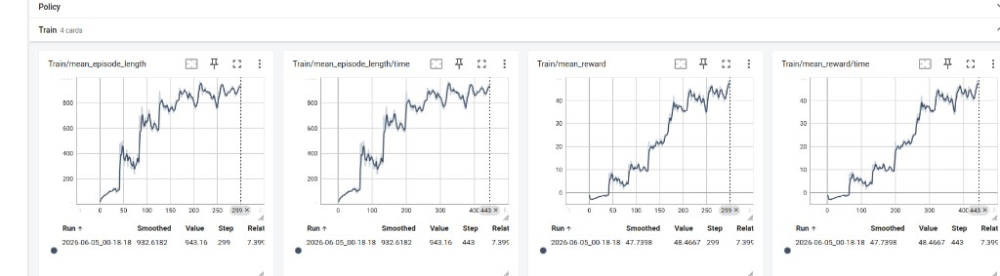
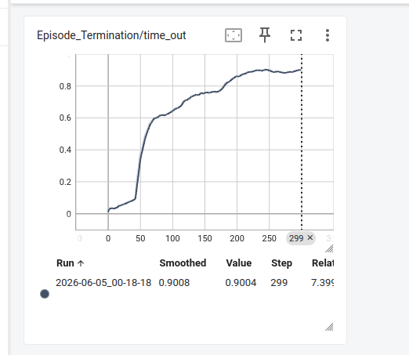
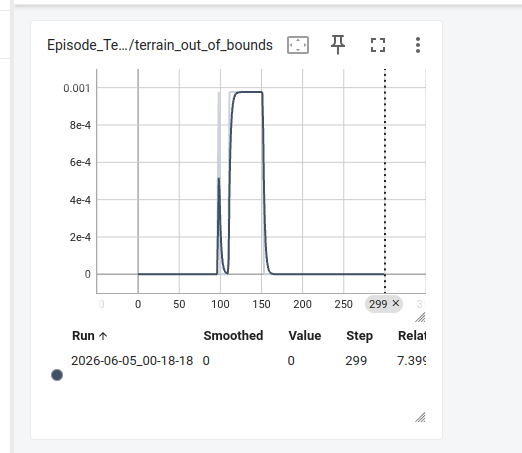
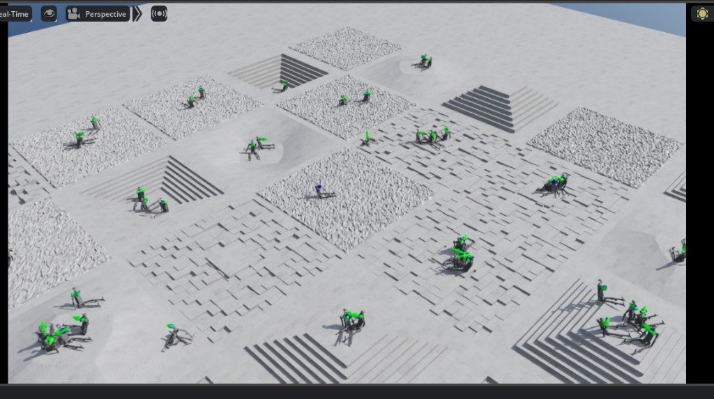
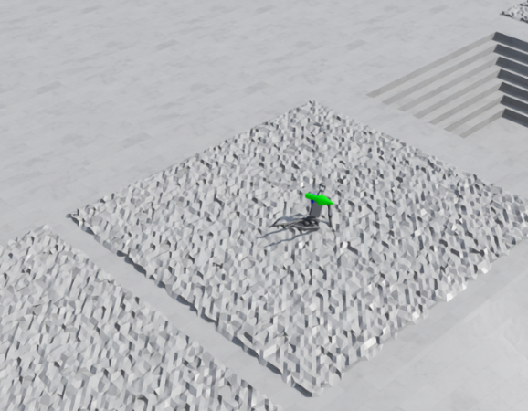

# 学习过程记录（URDF → 实机）

> 分支：`learn`  
> 练习机型：**Unitree H1**（`assets/my_h1.py`、`config/humanoid/unitree_my_h1/`）  
> **常用 task id：** `RobotLab-Isaac-Velocity-Rough-Unitree-My_H1`（Flat 另有注册，调试 spawn/训练/play 以 **Rough** 为准）  
> 详细命令与 H1 改 cfg 细则见 [LEARNING.md](./LEARNING.md)

按 **从 URDF 到部署实机** 的顺序分章；每章 **实践步骤** 写本机已做过的操作，**遇到的问题** 写当时踩坑与处理，**知识点** 写原理与排错。

---

## 总览

```text
第 1 章  环境与工具链
第 2 章  厂商 URDF 与描述包
第 3 章  Isaac asset 接入（my_h1.py）
第 4 章  Env 配置与 gym 注册
第 5 章  环境验证（zero_agent / random_agent）
第 6 章  RL 训练（train.py）
第 7 章  策略验证与导出（play.py → policy.pt）
第 8 章  Sim2Sim（rl_sar → MuJoCo）
第 9 章  实机部署（rl_sar → 真机）
```

| 章 | 在哪做 | 当前进度（简要） |
| --- | --- | --- |
| 1 | 本机 + conda | 已能 `train` / `zero_agent` 拉起 Sim |
| 2 | `data/Robots/...` | URDF + meshes 在位，MuJoCo 看过 |
| 3 | `robot_lab/assets/` | `my_h1.py`：`hip_pitch=-0.28`、踝 `armature=0.01`、腿/腰 PD；spawn 可站一阵 |
| 4 | `config/.../unitree_my_h1/` | `list_envs` 可见 My_H1 |
| 5 | `scripts/tools/` | `zero_agent` / `random_agent` / `spawn_check` 已跑 |
| 6 | `train.py` | **十一轮 My_H1** + **官方 H1 Flat / Rough baseline**（附录 C、D） |
| 7 | `play.py` | Run5/6 **转圈**；Run7 **蹭地**；Run8–11 **站住/微晃**；官方 Rough **叉腿侧挪**（均 **未通过会走**） |
| 8–9 | rl_sar / 实机 | 尚未进行 |

**分工牢记：** robot_lab = Isaac 里训；MuJoCo / Gazebo / 实机 = **rl_sar**。

---

## 第 1 章 环境与工具链

### 实践步骤

1. 使用 conda 环境 **`isaaclab`**（Isaac Sim 5.1 / Isaac Lab 2.3.2）。
2. 在 **`~/project/robot_lab`** 根目录跑脚本（`python scripts/...`）。
3. 本机曾跑通 **`train.py`**，终端有 iteration log。
4. 本机 **`zero_agent`** 能拉起 Sim。

### 知识点

| 工具 | 作用 | 和 ROS |
| --- | --- | --- |
| Isaac Sim / Isaac Lab | 训练用仿真 | 一般不用 |
| MuJoCo | 另一套物理仿真、viewer、rl_sar | 默认不用 ROS |
| Gazebo | 常配合 ROS launch | 绑得紧 |
| robot_lab | Isaac 里 RL 环境 | — |
| rl_sar | Sim2Sim / 实机跑策略 | 可选 ROS 桥 |

- 改 **已有** `.py` cfg：保存后 **重启脚本** 即可；`pip install -e` 仅在首次安装、改 `setup.py` 或新 task 注册不进去时再跑

---

## 第 2 章 厂商 URDF 与描述包

### 实践步骤

1. 使用仓库内已有目录：
   ```text
   source/robot_lab/data/Robots/unitree/h1_description/
   ├── urdf/h1.urdf
   ├── meshes/*.STL
   ├── package.xml
   └── mjcf/
   ```
2. 在 `h1_description/` 下用 MuJoCo 看过模型：
   ```bash
   cd .../h1_description
   python -m mujoco.viewer --mjcf=mjcf/scene.xml
   ```
   初始姿态偏「倒下」属正常，用于确认 mesh/关节树能加载。
3. 为第 3 章改 asset，对照 `h1.urdf` 里 **`type="revolute"`** 关节名（H1 约 19 个）。

### 遇到的问题

| 现象 | 原因 / 处理 |
| --- | --- |
| URDF 里 **`package://h1_description/meshes/...`** 会不会错？ | 厂商给 ROS 用的写法；mesh 在 `meshes/` 里就对。**接 Isaac 先不改**；Sim 报找不到 mesh 再改成 `../meshes/`。 |
| MuJoCo `mjcf/scene.xml` 里 **H1 是倒地的** | MJCF 默认姿态，不等于 Isaac 会倒；只用来确认能加载。 |
| 搞不清 **先写 package.xml 还是先写 URDF** | 顺序是 **URDF + meshes**，package.xml / mjcf 是后加的包装。 |

### 知识点

| 文件 | 作用 | Isaac 要不要 |
| --- | --- | --- |
| **URDF** | 关节树、限位、惯性、mesh 引用 | 要（经 asset 指向） |
| **meshes/** | 形状（STL 等） | 要 |
| **package.xml** | ROS 包名 + 依赖 | **不要** |
| **mjcf/** | MuJoCo 入口 | Isaac 不用 |

- **`imu_joint` 等 fixed**：不算 DOF，不进 actuators。
- **H1 vs G1**：H1 单踝 `*_ankle_joint`、腰 `torso_joint`；G1 双踝 + `waist_*` + 手腕。

---

## 第 3 章 Isaac asset 接入（`my_h1.py`）

### 实践步骤

1. 参考 `robot_lab/assets/unitree.py` 里 `UNITREE_G1_29DOF_CFG`，新建 **`robot_lab/assets/my_h1.py`**。
2. 已改：`asset_path` → `h1_description/urdf/h1.urdf`；导出 **`UNITREE_My_H1_CFG`**。
3. 已改 **`actuators`**：去掉 G1 独有（`waist_*`、双踝 `ankle_pitch/roll`、`wrist_*`），踝用 `.*_ankle_joint`，腰用 `torso_joint` 等 H1 名。
4. **`init_state.joint_pos`** 已按官方 H1 角填写（髋/膝/踝/肩/肘 + `torso_joint`）。
5. **`legs` 里 `torso_joint`** 已在 `effort_limit_sim` / `stiffness` / `damping` 等 dict 中单独配置；**`enabled_self_collisions=False`**（与官方 USD H1 一致）。
6. 本章用 **第 5 章 `zero_agent` / `spawn_check`** 验收 spawn；**zero 仍会倒**（官方 H1 task 的 zero 也会倒），不等于 asset 失败。

### 遇到的问题

| 现象 | 原因 / 处理 |
| --- | --- |
| `zero_agent` 崩：**`Not all regular expressions are matched`**，`ankle_pitch/roll`、`waist_*` 为 `[]` | `actuators` 仍写 G1 关节名。**处理：** 踝 `.*_ankle_joint`；删 `waist_*`、`wrist_*`；`torso_joint` 并进 legs 或单独一组。 |
| 改完 actuators 能 spawn，但 **仰躺** | 早期 `joint_pos` 仍是 G1。**处理：** 按官方 H1 改站立角（**已做**）。 |
| `torso_joint` 在 `legs` 组但 **无 PD 项** | 腰软塌 → 易倒。**处理：** 在各 motor dict 里为 `torso_joint` 补 effort/stiffness/damping 等。 |
| `enabled_self_collisions=True` | 自碰多 → 易扭倒。**处理：** 改为 `False` 对比 spawn。 |
| `torso_joint` 写在 `ImplicitActuatorCfg(...)` 外单独一行 | **SyntaxError**，包无法 import。**处理：** 只写在各 dict 内部。 |
| `Robot` **World Z≈1.05** 却躺着 | `pos` z 是骨盆 spawn 高度，不是站直；躺是 **joint_pos + 执行器 + 重力**。**处理：** 改角与 PD，不必盲目加 z。 |
| 踝 **`armature=100`**（G1 复制残留） | 踝锁死 → 先 upright 再 **后倒**。**处理：** 改为 **~0.01**（Run 5 前）。 |
| **`hip_pitch=-0.25`** | 侧倒。**处理：** 试 **-0.27～-0.28**（官方 **-0.28**）；Run 5 用 **-0.27**。 |

### 知识点

```text
h1.urdf           → 结构、关节名、限位（厂商）
my_h1.py          → 用哪个 URDF、spawn 高度、初始角、仿真电机 PD
env_cfg.py        → 任务、观测、奖励（下一章）
```

| `my_h1.py` 块 | 干什么 |
| --- | --- |
| `spawn` / `asset_path` | 导入哪个 URDF |
| `init_state.pos` | 根 link 生成高度（H1 ~1.05） |
| `init_state.joint_pos` | 生成关节角，正则要对 URDF 关节名 |
| `actuators` | 仿真电机分组；关节名必须 URDF 里存在 |

---

## 第 4 章 Env 配置与 gym 注册

### 实践步骤

1. 复制 **`config/humanoid/unitree_g1/`** → **`unitree_my_h1/`**。
2. **`rough_env_cfg.py`**：`from robot_lab.assets.my_h1 import UNITREE_My_H1_CFG`；`foot_link_name = ".*ankle_link"`。
3. **`flat_env_cfg.py`** / **`__init__.py`**：类名、task id 与 Rough 一致。
4. **`list_envs.py | grep -i my`** 能看到 **`RobotLab-Isaac-Velocity-Rough-Unitree-My_H1`**（及 Flat id）。

### 遇到的问题

| 现象 | 原因 / 处理 |
| --- | --- |
| import **`robot_lab.assets.unitree`** 里的 `UNITREE_My_H1_CFG` | cfg 在 **`my_h1.py`**。**处理：** 改为 `from robot_lab.assets.my_h1 import ...`。 |
| `flat_env_cfg` 仍是 **`UnitreeG1*`** | 复制 G1 后未改全。**处理：** `UnitreeMyH1RoughEnvCfg` / `UnitreeMyH1FlatEnvCfg`，`__init__.py` entry 一致。 |
| **`Overriding environment ... G1-v0`** | `__init__.py` 重复 register G1；警告可先忽略。 |

### 知识点

- **`foot_link_name`** 是 **link** 名，不是 joint。
- **Flat vs Rough**：你 zero 时用过 Rough，人落在台阶上仰躺。

---

## 第 5 章 环境验证（zero_agent / random_agent）

### 实践步骤

1. **`zero_agent`**（`--num_envs 1`，未 `--headless`）：
   ```bash
   cd ~/project/robot_lab
   python scripts/tools/zero_agent.py \
     --task=RobotLab-Isaac-Velocity-Rough-Unitree-My_H1 \
     --num_envs 1
   ```
   不报错；曾见 H1 **仰躺**（改 `joint_pos` 前）。
2. **`random_agent`**（`--num_envs 1`）：不崩；人仍躺地，随机动作下 **乱晃**（符合预期）。

### 遇到的问题

| 现象 | 原因 / 处理 |
| --- | --- |
| **`zero_agent`：Isaac 窗口能打开，界面卡住一会儿后进程崩掉** | **处理：** 在 `rough_env_cfg.py` 里注释与腰/torso 惩罚相关的两行。 |
| **视口里找不到人** | 默认 4096 env。**处理：** `--num_envs 1`；选 **`pelvis`** 按 **`F`**；Follow Mode → **Robot**。 |
| 人在 **地形一角仰躺** | 多 env 或 `joint_pos` 未对齐；Rough 上躺倒符合预期。 |
| 选 **`Robot` 按 F** 只对到 gizmo | 改选 **`pelvis`** 再 Frame。 |
| Property：**Center of Mass** 的 Z 不是坐标 | 看 **Transform → Translate**；**Offset**=Local，无 Offset≈World。 |

### 知识点

| | zero_agent | random_agent |
| --- | --- | --- |
| 动作 | 0 | 随机 |
| 验证 | spawn、配置、别立刻 NaN | 有动作时关节/接触别疯 |
| 进度 | 已做 | 已做 |

- **倒下不算失败**，说明还要改 `joint_pos`。
- 走得好不好是 **第 6 章 train** 的事。

---

## 第 6 章 RL 训练（train.py）

### 实践步骤

在 **`RobotLab-Isaac-Velocity-Rough-Unitree-My_H1`** 上 **`train.py` 已跑两轮**（不同时间戳目录）。查看曲线：

```bash
cd ~/project/robot_lab
tensorboard --logdir=logs/rsl_rl/unitree_my_h1_rough
```

（只有 `--logdir`，**没有** `--num_envs`。）

#### 训练 run 记录

| Run | 日志目录（`logs/rsl_rl/unitree_my_h1_rough/`） | 训练规模 | 当时 asset / 备注 |
| --- | --- | --- | --- |
| **Run 1** | `2026-06-05_00-18-18/` | 约 **`model_299`（~300 iter）**；配置默认 `max_iterations=3000`，**未训满** | **`joint_pos` / torso PD 等尚未按第 3 章改稳** |
| **Run 2** | `2026-06-05_02-18-34/` | **`max_iterations` 提到 20000**，实际训到约 **step ~20000**（~8 h） | 已用 **官方角 + torso PD + `enabled_self_collisions=False`** 后的 `my_h1.py`；env 与 Run 1 同版 |
| **Run 3** | `2026-06-05_01-50-51/` | 约 **521 iter**（~13 min）后 **主动停止**；未 play | **Run 3 实验 cfg**（见下表）；asset 同 Run 2 |
| **Run 4** | `2026-06-06_02-11-35/` | 至少 **~800 iter**（~21 min）；未 play | **Run 4 = Run 3 + Plan B1**（见下表） |
| **Run 5** | `2026-06-08_01-44-46/` | **~1558 iter**（~37 min）后 **停训 → play**；`max_iterations=3000` **未训满** | **spawn/PD 调通后的 asset + Run 4 基础上微调 env**（见下表）；**首次 play** |
| **Run 6** | `2026-06-08_02-30-08/` | **~2805 step**（~1 h）；停训 → **play**；未训满 3000 | **Run 5 + 关转向 + feet_air weight↑**（见下表）；**play 与 Run 5 同类** |
| **Run 7** | `2026-06-08_03-42-54/` | **~15000 step**（~2.8 h）；**训满/长训**；**已 play** | **Run 6 + plane 平地**（见下表）；**feet_air 先涨后跌** |
| **Run 8** | `2026-06-08_13-30-43/` | **~3507 step**（~41 min）；**短训**；**已 play（含强制 cmd 诊断）** | **Run 7 + `track_lin_vel` 3→1.5**（见下表） |
| **Run 9** | `2026-06-08_19-55-11/` | **~3000 step**（~35 min）；**短训**；**已 play** | **Run 8 + `feet_air` threshold 0.4→0.6**（见下表） |
| **Run 10** | `2026-06-08_20-35-41/` | **~9281 step**（~1.7 h）；**长训（未早停）**；**已 play** | **Run 9 + `base_height_l2` 关（weight=0）**（见下表） |
| **Run 11** | `2026-06-09_00-38-18/`（**续训**自 `00-21-52/`） | **~3820 step**（停训 → play）；**已 play** | **Run 10 + policy `base_lin_vel` obs 关（66 维）**（见下表） |

##### Run 3 相对 Run 2 的 env 改动（`rough_env_cfg.py`）

| 类别 | Run 2 | Run 3 |
| --- | --- | --- |
| **观测** | `base_lin_vel = None` | **恢复**（注释掉 `= None`，保留 `scale=2.0`）；`height_scan` 仍关 |
| **命令** | `lin/ang_vel` **±1.0** | **缩小**：`lin_vel_x/y`、`ang_vel_z` 均为 **(-0.3, 0.2)** |
| **base_height_l2** | weight **0** | weight **-1.0**，`target_height=0.9`（`torso_link`） |
| **feet_air_time** | weight **0.25** | weight **0.50**（threshold 仍 0.4） |
| **其余** | — | `undesired_contacts` 仍 **0**；地形、action scale、curriculum **未改** |

**实验意图（路线组合）：** **B** 小命令 + 恢复 `base_lin_vel`；**A** 躯干高度惩罚；**D** 迈步奖励加重。**未**整份抄官方 H1 数字。

##### Run 4 相对 Run 3 的 env 改动（Plan B1）

| 类别 | Run 3 | Run 4 |
| --- | --- | --- |
| **undesired_contacts** | weight **0** | weight **-0.5**（非 `.*ankle_link` 触地惩罚） |
| **其余** | — | 与 Run 3 **相同**（小命令、base_height、feet_air_time=0.5、base_lin_vel 等） |

**实验意图：** **路线 A** — 打破躺赢捷径，让 **膝/髋/身触地变贵**；**一次只改此项**（相对 Run 3）。

##### Run 5 相对 Run 4 的改动（asset + env）

**Asset（`my_h1.py`，Run 5 训前相对 Run 2/4 的累积）：**

| 项目 | Run 2/4 | Run 5 训前 |
| --- | --- | --- |
| **`hip_pitch`** | 官方 **-0.28** 或试过 **-0.25**（侧倒） | **-0.27** |
| **踝 `armature`** | 曾误 **100**（锁踝） | **0.01** |
| **踝 `effort_limit_sim`** | 较低 | **100** |
| **腿/腰 PD** | 有 `torso_joint` 但曾不全 | 髋膝 stiffness **~200**、阻尼 **5**；`torso_joint` 各 dict 齐全 |
| **自碰撞** | 曾 True | **`enabled_self_collisions=False`** |

**Env（`rough_env_cfg.py`，Run 5 训练时）：**

| 类别 | Run 4 | Run 5（训练时） |
| --- | --- | --- |
| **undesired_contacts** | **-0.5** | **-0.2**（略弱，ep length 更稳） |
| **feet_air_time** | weight **0.5** | weight **0.5**，threshold **0.4** |
| **命令** | 小范围全向 **(-0.3, 0.2)** | **同**（含 **`ang_vel_z`**） |
| **地形** | Rough | **Rough**（plane spawn 测试块 **已注释**） |
| **其余** | base_height、track=3、小命令 | 与 Run 3/4 **同系** |

**实验意图：** 在 **spawn 能站** 的前提下，验证 **RL 能否离开 Run 4 的 ~0.001 平台**；**~1500 iter 后 play 验收**。

##### Run 6 相对 Run 5 的 env 改动

| 类别 | Run 5 | Run 6 |
| --- | --- | --- |
| **命令 `lin_vel_x`** | **(-0.3, 0.2)** 全向小命令 | **(0, 0.3)** **只往前** |
| **`lin_vel_y`** | (-0.3, 0.2) | **(0, 0)** |
| **`ang_vel_z`** | (-0.3, 0.2) | **(0, 0)** — 意图打掉 **转圈吃角速度** |
| **feet_air_time** | weight **0.5** | weight **1.0**（threshold 仍 **0.4**） |
| **undesired_contacts** | -0.2 | **-0.2**（未改） |
| **asset** | hip_pitch **-0.27** 等 | **同 Run 5**（后改为 **-0.28** 与官方对齐） |
| **地形** | Rough | **Rough** |

**实验意图：** Run 5 play **单脚转圈** → **关 `ang_vel` + 只前进 + 迈步奖励加倍**；**~1500～2800 step 后 play**。

##### Run 7 相对 Run 6 的 env 改动（Plan B2）

| 类别 | Run 6 | Run 7 |
| --- | --- | --- |
| **地形** | Rough | **`terrain_type = "plane"`**，`terrain_generator = None`，`terrain_levels = None` |
| **命令 / feet_air / undesired** | 只前进、`feet_air=1.0`、`-0.2` | **与 Run 6 相同** |
| **`joint_deviation_hip_l1`** | **-0.1**（文档曾记；**env 快照实为 -0.2**） | **-0.2**（与 Run 7 **env.yaml 一致**） |
| **reset 随机化** | 默认开 | **默认开**（plane 三行外 event **未关**） |

**实验意图：** Run 6 play **Rough 站块转圈** → **平地逼位移**；计划 **~1500～2000 step → play**（实际 **训到 ~15000**）。

##### Run 8 相对 Run 7 的 env 改动

| 类别 | Run 7 | Run 8 |
| --- | --- | --- |
| **`track_lin_vel_xy_exp`** | weight **3.0** | weight **1.5**（**env.yaml 已确认**） |
| **plane / 命令 / feet_air** | 只前进、`feet_air=1.0`、`-0.2` | **与 Run 7 相同** |
| **训练规模** | **~15000 step** | **~3507 step**（**~1.5k 后 feet_air 回落**，未再长训） |

**实验意图：** Run 7 **track 顶满 + feet_air 崩盘** → **降 track 权重**，看能否 **像官方 Rough（track~1.4）** 同时 **抬高 feet_air**。

##### Run 9 相对 Run 8 的 env 改动

| 类别 | Run 8 | Run 9 |
| --- | --- | --- |
| **`feet_air_time.params["threshold"]`** | **0.4** | **0.6**（对齐官方 H1） |
| **`track_lin_vel_xy_exp`** | **1.5** | **1.5**（未改） |
| **plane / 命令 / feet_air weight** | 同 Run 7 | **与 Run 8 相同** |
| **训练规模** | **~3507 step** | **~3000 step**（**~1.5k 后 feet_air 回落**） |

**实验意图：** Run 8 **降 track 仍 10⁻³ feet_air** → **提高迈步 threshold** 向官方靠拢。

##### Run 10 相对 Run 9 的 env 改动

| 类别 | Run 9 | Run 10 |
| --- | --- | --- |
| **`base_height_l2`** | weight **-1.0**，`target_height=0.9` | weight **0**（`env.yaml` 为 **null**，官方关） |
| **`track` / threshold / plane / 命令** | track **1.5**、threshold **0.6**、plane | **与 Run 9 相同** |
| **`base_lin_vel` obs** | **开着**（policy **69 维**） | **开着**（与 Run 9 同；**play 旧 ckpt 须一致**） |
| **训练规模** | **~3000 step** | **~9281 step**（计划 **~2k 早停**，实际 **未停**） |

**实验意图：** Run 9 **threshold 无效** → **关 base_height**（一次只改此项），看躯干高度惩罚是否压制迈步。

##### Run 11 相对 Run 10 的 env 改动

| 类别 | Run 10 | Run 11 |
| --- | --- | --- |
| **policy `base_lin_vel` obs** | **开着**（**69 维**） | **`= None`**（**66 维**，对齐官方） |
| **`base_height` / track / threshold / plane / 命令** | 同 Run 9 | **与 Run 10 相同** |
| **训练** | 单次长训 | **先** `00-21-52` **~900 step** → **停** → **`--resume`** → **`00-38-18`** 续到 **~3820** |

**实验意图：** Run 10 **关 base_height 仍站桩** → **关 `base_lin_vel` obs**（一次只改此项）。

> **Run 11 之后（待 Run 12）：** plane 保留；**track=1.5`、`threshold=0.6`、`base_height=0`、`base_lin_vel` 关** 可保留；下一项 **`action scale 0.25`** 或 **`hip_pitch`/PD**（清单择一，**一次只改一项**）；**~3k 看 feet_air 峰后停**；play **峰附近 `model_2500`～`2800`**。训 Rough 前 **注释 plane 三行**。

#### Run 1 曲线摘要（旧 asset）

- **mean_episode_length** 后期约 **943**（上限约 1000 步 / 20 s）
- **mean_reward** 后期约 **48**
- **Episode_Termination/time_out** 后期约 **0.9**
- **Episode_Termination/terrain_out_of_bounds** 接近 **0**
- 未单独记录 `feet_air_time` / `track_lin_vel_xy_exp`（当时主要看总 reward）







#### Run 2 曲线摘要（新 asset，~20k iter）

**总指标（优化意义上的「收敛」）：**

| 指标 | 走势 | 末期约值 |
| --- | --- | --- |
| **mean_reward** | ~25 → ~60，**~15k step 后平台** | **~59**（smoothed） |
| **mean_episode_length** | ~5k step 后顶到上限 | **~991**（接近 1000） |

**locomotion 分项（是否「会走」）：**

| 指标 | 走势 | 末期约值 | 解读 |
| --- | --- | --- | --- |
| **Episode_Termination/time_out** | ~6k step 后顶到 ~1 | **~0.99** | 几乎每局 **撑满时限**，少早死 |
| **Episode_Reward/upward** | 升至 ~3.4 后平台 | **~3.45** | 躯干朝向奖励不低，**不等于在走** |
| **Episode_Reward/track_lin_vel_xy_exp** | **0.48～0.76 来回抖，无上升趋势** | smoothed **~0.68** | **没在持续学会跟速度命令** |
| **Episode_Reward/feet_air_time** | 量级极小，平台 | **~0.001** | **脚几乎不离地 → 没有迈步** |

**Run 2 结论（与 Run 1 play 对照）：**

- **总 reward / ep length / time_out** → **已收敛**，且比 Run 1 总 reward（~48）**更高**（~59）。
- **feet_air_time ≈ 0 + track_lin_vel 不涨** → 收敛到 **「躺赢 / 撑局」局部最优**，**不是双足行走策略**。
- **再加 iter 无意义**：locomotion 相关曲线在 **~6k～15k step 已平**，训到 20k **未换来走路**。
- **play**（Run 2 checkpoint）：预期仍 **基本躺地**（与上述分项一致）；**不是** checkpoint 没加载上。

#### Run 3 曲线摘要（~521 iter，主动停训）

**locomotion 分项（本 run 的停训依据）：**

| 指标 | 走势 | 约 521 iter 时 | 解读 |
| --- | --- | --- | --- |
| **Episode_Reward/feet_air_time** | ~0→~0.001 后 **横盘**（~120 iter 后几乎不涨） | smoothed **~0.001** | **仍几乎不迈步**；与 Run 2 **同量级**，**未达实验目标** |
| **Episode_Reward/track_lin_vel_xy_exp** | **持续上升** | smoothed **~1.5+**（高于 Run 2 的 ~0.68） | **速度跟踪分项变好**；因 **weight=3**，图上 **越大越好、上限约 3**（不是「越接近 1 越好」） |
| **Episode_Termination/time_out** | （未单独截图，结合 Run 2 模式） | 预期仍偏高 | 仍可能 **撑局** 为主 |

**Run 3 结论：**

- **主进度条 `feet_air_time` 失败**：加权提到 **0.5**、小命令、**base_height**、恢复 **base_lin_vel** 后，**~500 iter 内未离开 ~0.001 平台** → **不必继续堆 iter**（避免再演 Run 2：track 涨、脚仍不着地）。
- **track 升高 + feet_air_time≈0** → 策略可能在 **蹭地/滑/扭** 上更像跟命令，**不等于迈步**；验收仍看 **feet_air_time** 与 **play**。
- **下一步（Plan B，待做）：** `undesired_contacts`、降 **`max_init_terrain_level`**、**action scale 统一 0.25** 等，仍 **短训 + 只看 feet_air_time**；**未**在本 run 做 play。

#### Run 4 曲线摘要（~800 iter，相对 Run 3 略好）

**locomotion / 接触分项：**

| 指标 | 走势 | 约 800 iter 时 | 解读 |
| --- | --- | --- | --- |
| **Episode_Reward/feet_air_time** | **0～400 上升**，400 后 **平台 + 大抖** | smoothed **~0.001**，raw 偶发 **~0.0011～0.0014** | 比 Run 3 **略好**，仍 **10⁻³ 量级**，**未达「在学走」** |
| **Episode_Reward/undesired_contacts** | **0 → 约 -0.62** | smoothed **~-0.62** | 惩罚 **生效**；非脚触地 **多**（趴/蹭/膝髋着地） |
| **Train/mean_episode_length** | **未跌**（本机核对） | 仍接近顶满 | **-0.5 未罚到大量早死**；仍可能 **time_out 撑局** |

**Run 4 结论（相对 Run 3）：**

- **略好一丢丢**：`feet_air_time` 有 **0～400 上涨段**，峰值略高于 Run 3；**不是** breakthrough。
- **undesired_contacts 变负 + ep length 不跌** → 策略在 **「活得久 + 多触地罚 + 略抬脚」** 里调整，**骨架仍像躺赢**，但触地惩罚 **已进 loss**。
- **`-0.5` 暂可保留**（ep length 未暴跌）；若续训后仍 **~0.001**，再试 **-0.2** 或 **Plan B2 降地形**。
- **建议：** 同一 cfg **续到 1500～2000 iter**，仍只盯 **feet_air_time 能否 >0.002**；未达标再改下一项。**未** play。

**附带讨论（训练同期）：** 「是否根本没法站」要分层——**spawn 已能站一阵**（第 3 章）≠ **Rough+随机化+跟命令下 RL 已学会站/走**；Run 4 更像 **低姿态撑局 + 非脚触地多**，需 **Flat/降地形** 与 **asset/PD** 对照，不能单靠加 iter。

#### Run 5 曲线摘要（~1558 iter，相对 Run 4 明显进步）

**locomotion / 接触分项：**

| 指标 | 走势 | 约 1558 iter 时 | 解读 |
| --- | --- | --- | --- |
| **Episode_Reward/feet_air_time** | **~800 step 前缓涨，之后更陡** | smoothed **~0.0036**，raw **~0.0038** | 较 Run 4 **~3～4 倍**，仍 **10⁻³**；**未达「会走」线（>0.01）** |
| **Episode_Reward/track_lin_vel_xy_exp** | **~600 step 后平台** | smoothed **~2.1** / 上限约 **3** | 跟速度 **~70%**，**好** |
| **Train/mean_episode_length** | 快速顶满 | **~992** / 1000 | **几乎不摔** |
| **Episode_Reward/undesired_contacts** | **0 → ~-0.35 → 回升** | smoothed **~-0.08** | **非脚触地减少**，但未消除 |

**Run 5 play（`--load_run 2026-06-08_01-44-46`，约 `model_1550.pt`，`--num_envs 1`）：**

| 现象 | 说明 |
| --- | --- |
| **能站稳** | 相对 Run 1/2 **play 全程躺** → **质变** |
| **右脚不动，左脚微抬点地，以右脚为轴转圈** | **新局部最优**：吃 **`track_ang_vel` + 单脚 `feet_air_time` + 不倒**；**不是双足迈步** |
| **train 与 play 不能同时开** | 单 GPU 单 Sim；**Ctrl+C 停训 → play → `--resume` 续训** |

**Run 5 结论：**

- **Asset/spawn 线验收通过**：从「play 全躺」→ **能站、撑满一局**。
- **RL 有进步但未学会走**：`feet_air_time` **0.001 → ~0.004**；**track 高 ≠ 迈步**。
- **策略捷径 = 单脚转圈**；**不必续训本 run 到 3000**（再加 iter 多半转得更顺）。
- **下一步 Run 6**：关 **`ang_vel_z`**、只往前命令、**`feet_air_time.weight=1.0`**（见 Run 6）。

#### Run 6 曲线摘要（~2805 step，相对 Run 5）

**locomotion / 接触分项：**

| 指标 | 走势 | 约 2805 step 时 | 相对 Run 5 |
| --- | --- | --- | --- |
| **Episode_Reward/feet_air_time** | **~700 陡升**，1000 后 **平台 + 大抖** | smoothed **~0.0023**，raw **~0.0028** | **同量级 10⁻³**，**未突破 0.01**；峰值略低于 Run 5 **~0.004** |
| **Episode_Reward/track_lin_vel_xy_exp** | **400～800 陡升**，800 后 **0.6～0.98 振荡** | smoothed **~0.88**（纵轴约 **0～1**） | **跟前进命令** 明显变好；与 Run 5 **~2.1**（纵轴约 **0～3**）**尺度不同**，**同 run 内趋势** 为准 |
| **Episode_Reward/undesired_contacts** | 400～800 暂罚到 **~-0.04**，后回升 | smoothed **~-0.01** | **明显好于** Run 5 **~-0.08** |
| **Train/mean_episode_length** | （模式同前） | 预期仍 **~990+** | 仍 **几乎不摔** |

**Run 6 play（`--load_run 2026-06-08_02-30-08`，`--num_envs 1`）：**

| 现象 | 说明 |
| --- | --- |
| **仍不迈步** | **无** 左右脚交替前进 |
| **以右脚为轴慢慢转身** | 与 Run 5 **几乎相同**；**关 `ang_vel` 命令未能打掉转圈**（慢转时 **`ang_vel_z≈0`** 仍高分） |
| **腿叉很开（马步）** | 策略 **增大 `hip_roll`**：`joint_deviation_hip_l1` 仅 **-0.1**（官方 H1 **-0.2**），**转圈求稳** 合算；spawn 默认 **hip_roll=0** |
| **Rough 方块上站定转** | 不必 **跨块迈步** 也能 **track + 活满一局** |

**Run 6 结论：**

- **有效部分：** **undesired** 更好（~-0.01）；**前进 track** 在 run 内 **0.1→~0.9**。
- **无效部分：** **feet_air 仍 ~0.003**；play **仍单脚转圈** — **捷径不依赖 ang_vel 命令**。
- **不必续训到 3000**：**~1000 step 后 feet_air 已平台**。
- **下一步 Run 7（Plan B2）：** **plane 平地**（见 Run 7）。

#### Run 7 曲线摘要（~15000 step，plane；相对 Run 6 **退步**）

**locomotion / 接触分项：**

| 指标 | 走势 | 约 15000 step 时 | 相对 Run 6 |
| --- | --- | --- | --- |
| **Episode_Reward/track_lin_vel_xy_exp** | **500～1500 陡升**，2000 后 **平台 ~2.9** | smoothed **~2.90** / 上限 **~3** | **几乎满分**；Run 6 同项纵轴尺度不同，**本 run 内极强** |
| **Episode_Reward/undesired_contacts** | 初差，**~2000 后 ≈0** | smoothed **~-0.003** | **略好于** Run 6 **~-0.01** |
| **Episode_Reward/feet_air_time** | **0～2000 升至 >0.0015**，之后 **持续下跌 + 大抖** | smoothed **~0.0003** | **远差于** Run 5/6 **~0.003**；**长训把抬脚「训没」** |

**Run 7 结论：**

- **plane 未换来迈步**：**track≈3、undesired≈0** 极好看，但 **feet_air 末期崩盘** → **蹭/扭跟速度** 局部最优，**不是走路收敛**。
- **训太久（~15k iter）是失误**：**~2k iter 后 feet_air 已下跌** → 应 **早停 + play 早期 ckpt**；与 Run 2「堆 iter 无效」**同类教训**。
- **下一步 Run 8：** plane 保留；优先 **`track_lin_vel` weight 3→1.5**；**硬停 ~2000 iter**。

**Run 7 play 验收（`2026-06-08_03-42-54`，`model_2000.pt`，plane，`--num_envs 1`）：**

| 项 | 结果 |
| --- | --- |
| **ckpt 选择** | **`model_2000.pt`**（≈ feet_air 峰值 iter）；**勿用** 末期 pt（`feet_air` 已 ~0.0003） |
| **加载命令** | `--checkpoint` 须 **绝对路径**（仅写 `model_2000.pt` 会 `FileNotFoundError`） |
| **摔不摔** | **不摔**，能 **撑住 upright** |
| **动不动** | **有前进位移**，在跟命令 |
| **抬不抬脚** | **基本不抬**；**双脚贴地**，像 **僵尸/双脚点地往前蹭或小幅跳** |
| **和 Run 5/6 比** | **不再单脚转圈** → 捷径变成 **「双脚蹭速度」** |
| **和曲线** | 与 **iter~2000 时 feet_air ~0.0015** 一致；**远低于** 官方 Flat **~0.056** |
| **验收结论** | **未通过「会走」**；**通过「能站 + 能挪」**；Run 8 降 **track** 权重 |

#### Run 8 曲线摘要（~3507 step，plane；**track=1.5**）

**locomotion / 接触分项：**

| 指标 | 走势 | 约 3507 step 时 | 相对 Run 7 |
| --- | --- | --- | --- |
| **Episode_Reward/track_lin_vel_xy_exp** | **~150 起升**，**~1400 后平台** | smoothed **~1.37**（上限 **~1.5**） | **不再顶 ~2.9**；形态 **接近官方 Rough ~1.44** |
| **Episode_Reward/feet_air_time** | **~1500 峰值 ~0.002**，之后 **回落 + 大抖** | smoothed **~0.0006** | 峰值 **略高于** Run 7 同期；**仍 10⁻³**，**未过 0.01** |
| **Episode_Reward/undesired_contacts** | 初差，**~1400 回近 0** | smoothed **~-0.01** | 与 Run 7 **同类** |

**Run 8 结论：**

- **降 track 有效一半：** **track 不再刷满分**，曲线形态 **对齐官方 Rough**；**feet_air 未突破**（仍 **~0.002 峰**）。
- **~1500 step 后 feet_air 下跌** → **应早停**；末期 **~3500** 无必要。
- **play（常规）：** 肉眼 **几乎不动**（位移 **厘米级**）。
- **play（临时强制 `cmd=0.3` 诊断，已注释）：** `cmd=[0.3,0,0]`、**|action|≈0.3～0.44** → **play 链路正常**；**vx 很快 ≈0**，**Δx≈0.05 m 后平台** → **策略站住，不跟速迈步**。
- **Run 7 同诊断：** 强制 0.3 下 **同样 vx≈0** → **不是 Run 8 独有**，**My_H1 策略普遍不会走**。
- **下一步 Run 9：** **track=1.5** + **`feet_air threshold=0.6`**。

**Run 8 play 验收（`2026-06-08_13-30-43`，`model_1500.pt`，plane，`--num_envs 1`）：**

| 项 | 结果 |
| --- | --- |
| **ckpt** | **`model_1500.pt`**（≈ feet_air 峰值）；勿用 **model_3500** |
| **摔不摔** | **不摔** |
| **动不动（常规 play）** | **几乎看不出**；诊断下 **Δx~5 cm 后停** |
| **抬不抬脚** | **否** |
| **验收结论** | **未通过「会走」**；降 track **未解决迈步** → **Run 9 threshold** |

#### Run 9 曲线摘要（~3000 step，plane；**track=1.5 + threshold=0.6**）

**locomotion / 接触分项：**

| 指标 | 走势 | 约 3000 step 时 | 相对 Run 8 |
| --- | --- | --- | --- |
| **Episode_Reward/track_lin_vel_xy_exp** | **~1k 起升**，**~2k 后平台** | smoothed **~1.29**（上限 **~1.5**） | **同量级**（Run 8 **~1.37**） |
| **Episode_Reward/feet_air_time** | **~1.5k 峰值 ~0.002**，之后 **回落 + 抖** | smoothed **~0.0008** | **几乎相同**；**threshold 0.6 无突破** |
| **Episode_Reward/undesired_contacts** | 初跌至 **~-0.07**，**~2k 回 ≈0** | smoothed **~0** | 略 **好于** Run 8 **~-0.01** |

**Run 9 结论：**

- **`threshold 0.6` 无效：** 曲线与 Run 8 **同形态**；**feet_air 仍 10⁻³**，**未靠近官方 ~0.016**。
- **~1500 step 后 feet_air 下跌** → **早停**；勿用末期 ckpt。
- **下一步 Run 10：** **`base_height_l2 = 0`**（一次只改此项）。

**Run 9 play 验收（`2026-06-08_19-55-11`，`model_1500.pt`，plane，`--num_envs 1`）：**

```bash
python scripts/reinforcement_learning/rsl_rl/play.py \
  --task=RobotLab-Isaac-Velocity-Rough-Unitree-My_H1 \
  --load_run 2026-06-08_19-55-11 \
  --checkpoint /home/elken/project/robot_lab/logs/rsl_rl/unitree_my_h1_rough/2026-06-08_19-55-11/model_1500.pt \
  --num_envs 1
```

| 项 | 结果 |
| --- | --- |
| **ckpt** | **`model_1500.pt`**（≈ feet_air 峰值）；勿用 **model_3000+** |
| **摔不摔** | **不摔**，直立站稳 |
| **动不动** | **基本不动**；与 Run 8 **同类**（肉眼难辨位移） |
| **抬不抬脚** | **否**；无左右交替 |
| **命令可视化** | 身上有 **绿色速度箭头/圆盘**（有前进命令） |
| **和 Run 8 play** | **同样站住**；**threshold 未改善步态** |
| **验收结论** | **未通过「会走」** → **Run 10 `base_height=0`** |

#### Run 10 曲线摘要（~9281 step，plane；**base_height_l2 关**）

**locomotion / 接触分项：**

| 指标 | 走势 | 约 1500 / 3000 / 9281 step | 相对 Run 9 |
| --- | --- | --- | --- |
| **Episode_Reward/track_lin_vel_xy_exp** | **~1.5k 起升**，**~2k 后平台** | **~1.33** / **~1.33** / **~1.27** | **同量级**（Run 9 **~1.29**） |
| **Episode_Reward/feet_air_time** | **~1.5k 峰 ~0.002**，之后 **持续下跌** | **~0.002** / **~0.0004** / **~0.0002** | **同形态**；关 base_height **无突破** |
| **Episode_Reward/undesired_contacts** | 初差，**~3k 后近 0** | **~-0.04** / **~-0.003** / **~0** | 略 **好于** Run 9 |
| **Train/mean_reward** | 持续上涨 | 末期 **~145** | — |
| **Train/mean_episode_length** | 接近满 | 末期 **~983** | — |

**Run 10 结论：**

- **`base_height_l2=0` 无效：** 曲线与 Run 8/9 **同形态**；**feet_air 仍 10⁻³ 级**，**~1.5k 后崩盘**。
- **长训无益：** 计划 **~2k 停**，实际 **~9281 step（~1.7 h）**；末期 **feet_air ~0.0002**，**勿用晚期 ckpt**。
- **下一步 Run 11：** **`base_lin_vel` obs 关**（一次只改一项）；**严格 ~2k 早停**。

**Run 10 play 验收（`2026-06-08_20-35-41`，`model_1500.pt`，plane，`--num_envs 1`）：**

```bash
python scripts/reinforcement_learning/rsl_rl/play.py \
  --task=RobotLab-Isaac-Velocity-Rough-Unitree-My_H1 \
  --load_run 2026-06-08_20-35-41 \
  --checkpoint /home/elken/project/robot_lab/logs/rsl_rl/unitree_my_h1_rough/2026-06-08_20-35-41/model_1500.pt \
  --num_envs 1
```

| 项 | 结果 |
| --- | --- |
| **ckpt** | **`model_1500.pt`**（≈ feet_air 峰值）；勿用 **model_3000+** |
| **加载** | 若 `rough_env_cfg` 里 **`base_lin_vel = None`**（66 维）→ **报错 69 vs 66**；**play Run 10 须注释该行**（与训练 `env.yaml` 一致） |
| **摔不摔** | **不摔**，直立站稳（plane 网格） |
| **动不动** | **基本不动**；与 Run 8/9 **同类** |
| **抬不抬脚** | **否** |
| **play 能跑 ≠ 会走** | Sim 窗口正常、策略每步推理；**站桩**是 **策略行为**，不是 play 管线坏了 |
| **验收结论** | **未通过「会走」** → **Run 11 关 `base_lin_vel` obs** |

#### Run 11 曲线摘要（~3820 step，plane；**policy `base_lin_vel` 关**）

**日志：** 主目录 **`2026-06-09_00-38-18/`**（`--resume` 自 **`2026-06-09_00-21-52/`**）。

**locomotion / 接触分项：**

| 指标 | 走势 | 约 1500 / 2800 / 3000 / 3820 step | 相对 Run 10 |
| --- | --- | --- | --- |
| **Episode_Reward/feet_air_time** | **~2.5k–2.8k Smoothed 峰 ~0.0017**，之后 **回落** | **~0.001** / **~0.002** / **~0.0015** / **~0.0009** | **峰略晚、略高**，仍 **10⁻³**；**勿盯单步尖峰** |
| **Episode_Reward/track_lin_vel_xy_exp** | **持续上升** | **~0.61** / **~1.08** / **~1.14** / **~1.24** | **高于** Run 10 同期；末期 **接近 Run 8/9 ~1.3** |
| **Episode_Reward/undesired_contacts** | **持续改善 → 近 0** | **~-0.15** / **~-0.06** / **~-0.06** / **~0** | **好于** Run 10 |

**Run 11 结论：**

- **`base_lin_vel` obs 关 无效：** play 仍 **站桩**；`feet_air` **过不了 0.01**；**track 能到 ~1.2+ 不等于会走**。
- **早停点：** **~2800–3000** 后 `feet_air` Smoothed **掉头** → play **`model_2500` / `model_2800`**，勿用末期。
- **读图注意：** 原始 Value **单步尖峰**（偶发 **~0.004+**）会被 Smoothed 抹平；**以 Smoothed / 区间均值判断**。
- **play 前须停训：** 与 `train.py` 同时跑会报 **`create_articulation_view` / `_physics_sim_view` None**。
- **下一步 Run 12：** **`action scale 0.25`**（或 hip/PD，**一次一项**）。

**Run 11 play 验收（`2026-06-09_00-38-18`，`model_2800.pt`，plane，`--num_envs 1`）：**

```bash
python scripts/reinforcement_learning/rsl_rl/play.py \
  --task=RobotLab-Isaac-Velocity-Rough-Unitree-My_H1 \
  --load_run 2026-06-09_00-38-18 \
  --checkpoint /home/elken/project/robot_lab/logs/rsl_rl/unitree_my_h1_rough/2026-06-09_00-38-18/model_2800.pt \
  --num_envs 1
```

| 项 | 结果 |
| --- | --- |
| **ckpt** | **`model_2800.pt`**（`feet_air` Smoothed 峰附近）；备选 **`model_2500`** |
| **加载** | policy **`base_lin_vel = None`**（**66 维**）；与 Run 10（**69 维**）**不可混用 ckpt** |
| **摔不摔** | **不摔**，直立站稳 |
| **动不动** | **基本不动**；关节 **轻微晃**（微调平衡） |
| **抬不抬脚** | **否** |
| **和 Run 8/9/10 play** | **同类站桩**；关 `base_lin_vel` **未改善步态** |
| **验收结论** | **未通过「会走」** → **Run 12**（如 **`action scale 0.25`**） |

#### play 验收总表（My_H1）

| Run | ckpt | 地形（训/play） | 摔？ | 动？ | 抬脚？ | 肉眼行为（简称） | 会走？ |
| --- | --- | --- | --- | --- | --- | --- | --- |
| 1/2 | 旧 | Rough | 常倒 | — | 否 | **全程躺/匍匐** | 否 |
| 5 | ~1550 | Rough | 否 | 慢 | 几乎否 | **右脚为轴转圈** | 否 |
| 6 | 默认/晚期 | Rough | 否 | 慢 | 几乎否 | **转圈 + 腿叉开** | 否 |
| 7 | **2000** | **plane** | **否** | **是** | **否** | **双脚贴地往前蹭/小跳** | **否** |
| 8 | **1500** | **plane** | **否** | **几乎否**（诊断 **~5 cm**） | **否** | **站住/微挪，不跟 0.3** | **否** |
| 9 | **1500** | **plane** | **否** | **几乎否** | **否** | **站住不动**（有绿箭头命令） | **否** |
| 10 | **1500** | **plane** | **否** | **几乎否** | **否** | **站住不动**（`base_height=0` 无效） | **否** |
| 11 | **2800** | **plane** | **否** | **几乎否** | **否** | **站住 + 轻微晃**（关 `base_lin_vel` 无效） | **否** |
| **官方 Rough** | 默认/晚期 | **Rough** | **否** | **是** | **偶发/弱** | **两腿叉开、侧向挪/小跳，非左右交替** | **否** |
| 官方 Flat | ~15k | Flat | — | — | — | （**未 play**；**feet_air ~0.056** 参考） | 待验 |

**「会走」验收线（play 为主，曲线为辅）：**

| 层级 | 条件 | 说明 |
| --- | --- | --- |
| **必要（曲线）** | **`feet_air` 长期 >0.01** | 官方 Rough **~0.016**、Flat **~0.05+** 仅说明分项在涨 |
| **必要（play）** | **左右脚交替**、**朝命令方向**、**脚明显离地** | **不能**只靠 `feet_air` 分项 |
| **充分** | 上两项 **同时** 满足，且肉眼为 **前行/转向步态**（非转圈、非叉腿侧挪、非双脚蹭地） | 官方 Rough **曲线过线、play 未过** → **`feet_air>0.01` 不充分** |

**TensorBoard 多曲线：** 搜索框用正则，例如  
`Episode_Reward/(feet_air_time|track_lin_vel_xy_exp|undesired_contacts)|Train/mean_episode_length`

### TensorBoard 怎么看（本任务分析顺序）

#### 通用读图

| 元素 | 含义 |
| --- | --- |
| **横轴 Step** | 训练 logger 记录的步数（**不是**走了多少米） |
| **纵轴 Value** | 多 env 上该指标的 **平均值** |
| **浅色线** | 原始值（抖） |
| **深色线（Smoothed）** | 看 **趋势** 用这个 |
| **悬停** | 读 Value / Smoothed / Step / 训练时长 |

**原则：** 看 **趋势与平台期**，不盯单点尖峰。

#### 各曲线含义与期望

| 搜索名 | 是什么 | 怎么看 | 好 / 坏（本任务） |
| --- | --- | --- | --- |
| **Train/mean_reward** | 所有奖励项 **加权和** 平均 | 涨后走平 = PPO 认为学不动了 | 高 **≠** 会走；Run 2 ~59 仍可能躺 |
| **Train/mean_episode_length** | 一局 **活了多少仿真步**（上限 ~1000） | 接近 1000 = 少早死 | 顶满 **≠** 站着走；趴满 20 s 也是 1000 |
| **Episode_Termination/time_out** | 结束的局里 **超时** 的比例 | 接近 1 = 几乎都撑满时限 | Run 2 **~0.99** → 学会 **熬 timeout** |
| **Episode_Reward/track_lin_vel_xy_exp** | xy **速度跟踪**（× **weight=3**，上限约 **3**） | 同一 run 内越高越好；**高 ≠ 迈步** | Run 7 **~2.9** 仍可能蹭地；须与 **feet_air** 对照 |
| **Episode_Reward/feet_air_time** | **脚离地** 相关（鼓励迈步） | 应 **>0 且训练中长期上涨**；**>0.01** 更像在学走；**~0.05+** 参考官方 Flat | My_H1 **~0.003**；官方 Rough **~0.016**、Flat **~0.056**（附录 C/D） |
| **Episode_Reward/undesired_contacts** | **非脚触地** 惩罚（weight<0 时越负触地越多） | 越接近 **0** 越好 | Run 7 **~-0.003**；Run 6 **~-0.01** |
| **Episode_Reward/upward** | **躯干竖直/朝上** | 较高说明姿态项不差 | 单独高不够；可与 feet_air_time **分开看** |
| **Episode_Termination/terrain_out_of_bounds** | 走出地形格 | 低 = 少出界 | Run 1/2 均低，**不能说明会走** |

#### 组合判读（口诀）

```text
mean_reward ↑ + ep_length ≈ 1000 + time_out ≈ 1
    → 「总指标收敛、活得久」（可能是躺赢）

feet_air_time ≈ 0 + track_lin_vel 涨但仍 ≪ 上限
    → 「跟踪数字变好、脚仍不着地」→ 可能是蹭地/滑/转圈，不是走路

feet_air_time ~0.004 + track ~2.1 + play 单脚转圈
    → Run 5：**能站的新捷径**；改命令/奖励开新 run，别堆 iter

feet_air ~0.003 + undesired ~-0.01 + play 仍转圈（Run 6）
    → 关 ang_vel 不够；下一 run **plane** + 可选加重 **hip_roll 偏离罚**

track ~2.9 + undesired ~0 + feet_air 下跌至 ~0.0003（Run 7）
    → **指标满分、不会走**；~2k 后 feet_air 跌 → **早停**；play **早期 ckpt**

play 躺地 + feet_air_time ≈ 0
    → 停训 / 改 Plan B，别堆 iter
```

#### 建议日常看板顺序

1. **feet_air_time** — 有没有在学走  
2. **track_lin_vel_xy_exp** — 有没有跟命令  
3. **Episode_Termination/**（time_out、illegal_contact 等）— 摔得多还是熬 timeout  
4. **mean_reward** — 总趋势  
5. **mean_episode_length** — 辅助  

**验收「会走」：** play 里 **双足跟命令** + 训练里 **feet_air_time、track_lin_vel 持续上升**；**不能**只看 mean_reward / time_out。

### 遇到的问题

| 现象 | 原因 / 处理 |
| --- | --- |
| Run 1：**mean_episode_length ~943、time_out ~0.9**，**play 全倒** | 见 **第 7 章**；且 Run 1 **asset 未改稳 + 仅 ~300 iter**。 |
| Run 2：**mean_reward ~59、训满 ~20k**，**play 仍躺** | **躺赢收敛**：总指标好，**feet_air_time≈0、track_lin_vel 不涨**。 **再加 iter 无效**；改 **奖励/地形** 再重训。 |
| Run 3：**路线 B+A+D**，**~521 iter** 后 **feet_air_time 仍 ~0.001**、**track ~1.5** | **主动停训**；进 **Plan B1**（Run 4）。 |
| Run 4：**undesired_contacts=-0.5**，**~800 iter**，**feet_air 略好仍 ~0.001**，**undesired ~-0.62**，**ep length 未跌** | **略优于 Run 3**；Run 5 已接棒。 |
| Run 5：**spawn/PD + undesired=-0.2**，**~1558 iter**，**feet_air ~0.004**，**play 能站但单脚转圈** | → **Run 6**（关 `ang_vel`、feet_air×2）。 |
| Run 6：**关 ang_vel + feet_air=1.0**，**~2805 step**，**play 仍转圈、腿叉开** | → **Run 7 plane**。 |
| Run 7：**plane + 同 Run6 命令**，**~15k step**，**track≈2.9、feet_air 跌至 0.0003** | **勿用末期 ckpt**；**~2k 早停** → **Run 8**。 |
| Run 8：**track=1.5**，**~3507 step**，**track≈1.37、feet_air 峰 ~0.002**；play **站住/微挪** | → **Run 9** threshold。 |
| Run 9：**threshold=0.6**，**~3000 step**，曲线 **≈Run 8**；play **站住不动** | **threshold 无效** → **Run 10**（**`base_height=0`**）。 |
| Run 10：**base_height=0**，**~9281 step**（应 **~2k 停**），**feet_air 1.5k 峰 ~0.002 后跌至 ~0.0002**；play **站住不动** | **base_height 无效** → **Run 11**（**关 `base_lin_vel` obs**）。 |
| Run 11：**关 `base_lin_vel`**，**~3820 step**（峰 **~2800**），**track~1.24、feet_air 仍 10⁻³**；play **`model_2800` 站住+微晃** | **`base_lin_vel` 无效** → **Run 12**（**action scale** 等）。 |
| **play 报 69 vs 66（`mlp.0.weight`）** | **policy obs 与训时不一致**（**`base_lin_vel` 关/开**）；play 须 **对齐该 run 的 `env.yaml`**。 |
| **play 报 `create_articulation_view` None** | **`train.py` 仍在跑**；**先停训再 play**。 |
| **feet_air 训练中期下跌** | **立刻停训**（Run 7/8/10）；play **峰值 ckpt**（Run 8/9/10：**model_1500**）。 |
| **train 时无法同时 play** | 单 GPU 单 Isaac Sim；**停训 → play → `--resume` 续训**（`save_interval=50`）。 |
| **play `--checkpoint` 找不到文件** | 须 **绝对路径**；或只 `--load_run`（会加载 **最新** pt，Run 7 **勿用**） |
| 误以为 **track_lin_vel 图上 >1 = 满分** | 该项 **× weight(3)**，**上限约 3**；Run 5 **~2.1** 仍可能 **转圈/蹭地**，**不能代替 feet_air_time**。 |
| 误以为 **reward 收敛 = 训好了** | 分项曲线可证明 **没学走**（见 Run 2 / Run 3）。 |
| 误以为 **ep length 1000 = 走了 1000 步** | = **仿真步数 / 活满时限**，可能是趴着。 |
| **`max_iterations=20000` / 长训 ~15k** | Run 2 / **Run 7**：总指标 / **track 还能顶满**，**feet_air 可反而下跌** → **~2k 看 feet_air 趋势即停**。 |

### 知识点

- **两种「收敛」：** ① **总 reward / track 收敛**；② **走路收敛**（**feet_air_time 明显 >0.001 且上涨** + play 会走）。Run 2 / Run 3 只有 ① 或 track 部分 ①。
- **Run 3：** **`feet_air_time` 0.25→0.5** 仍 **~0.001** → 单靠加重迈步 **不够**。
- **Run 4：** **`undesired_contacts=-0.5`** → **feet_air 略升、undesired 进 loss、ep length 稳**；**仍非走路收敛**。
- **Run 5：** **spawn/PD 调通** 后 **feet_air ~0.004**、**play 能站**；策略 **单脚转圈**（吃 `ang_vel` 命令 + 单脚 `feet_air_time`）。
- **Run 6：** **关 `ang_vel` + feet_air×2** → play **仍转圈**；**叉腿** = hip_roll 偏离，**-0.1 偏弱**。
- **Run 7：** **plane** + play **`model_2000.pt`** → **不摔、前进、不抬脚**（**僵尸双脚蹭/跳**）；曲线 **feet_air 2k 后崩盘**。
- **Run 8：** **`track=1.5`** + **~3.5k** → **track≈1.37**、**feet_air 峰 ~0.002**；play **几乎不动**；强制 cmd 诊断 → **play 链路 OK**。
- **Run 9：** **`threshold=0.6`** + **~3k** → 曲线 **≈Run 8**；play **`model_1500`** **站住不动**（有命令箭头）。
- **Run 10：** **`base_height=0`** + **~9.3k**（应早停）→ **feet_air 峰 ~0.002 @1.5k** 后 **~10⁻⁴**；play **站住不动**；**play 能开窗口 ≠ 会走**。
- **play obs 对齐：** checkpoint **actor 输入维** 须与训时一致（Run 10：**69**；Run 11：**66** = **无 `base_lin_vel`**）。
- **Run 11：** **关 `base_lin_vel` obs** + **~3.8k** → **feet_air Smoothed 峰 ~0.0017 @2.5k–2.8k**；play **`model_2800`** **站住+微晃**；**track~1.24 仍不等于会走**。
- **验收线：** feet_air **>0.01 且勿中期下跌** + play **交替抬脚前进**。
- **`Episode_Reward/track_lin_vel_xy_exp`：** 裸 exp 每步 ≤1；TensorBoard 为 **加权 episode 统计**（**weight=3** 时 **越大越好，上限约 3**）。
- 日志：`logs/rsl_rl/<experiment_name>/<时间戳>/`；`play` 用 **`--load_run 时间戳`** 指向对应 run。

---

## 第 7 章 策略验证与导出（play.py）

### 实践步骤

1. **`play.py`**（`--task` 与训练一致，Rough；`--load_run` 为时间戳目录名如 `2026-06-05_00-18-18`，**不必写 pt 名**，默认最新 `model_*.pt`）：
   ```bash
   cd ~/project/robot_lab
   python scripts/reinforcement_learning/rsl_rl/play.py \
     --task=RobotLab-Isaac-Velocity-Rough-Unitree-My_H1 \
     --load_run 2026-06-05_00-18-18
   ```
2. **Run 1/2**：多 env / 单 env 均 **基本躺地**，看不出双足行走。
3. **Run 5**（`--load_run 2026-06-08_01-44-46`，约 `model_1550.pt`，`--num_envs 1`）：
   ```bash
   cd ~/project/robot_lab
   python scripts/reinforcement_learning/rsl_rl/play.py \
     --task=RobotLab-Isaac-Velocity-Rough-Unitree-My_H1 \
     --load_run 2026-06-08_01-44-46 \
     --checkpoint model_1550.pt \
     --num_envs 1
   ```
   **现象：** **能站稳**；**右脚钉死、左脚微抬点地、以右脚为轴转圈**——见第 6 章 Run 5。
4. **Run 6**（`--load_run 2026-06-08_02-30-08`，`--num_envs 1`）：
   ```bash
   python scripts/reinforcement_learning/rsl_rl/play.py \
     --task=RobotLab-Isaac-Velocity-Rough-Unitree-My_H1 \
     --load_run 2026-06-08_02-30-08 \
     --num_envs 1
   ```
   **现象：** 见第 6 章 Run 6。
5. **Run 7**（`--load_run 2026-06-08_03-42-54`，**`model_2000.pt`**，`--num_envs 1`）：
   ```bash
   python scripts/reinforcement_learning/rsl_rl/play.py \
     --task=RobotLab-Isaac-Velocity-Rough-Unitree-My_H1 \
     --load_run 2026-06-08_03-42-54 \
     --checkpoint /home/elken/project/robot_lab/logs/rsl_rl/unitree_my_h1_rough/2026-06-08_03-42-54/model_2000.pt \
     --num_envs 1
   ```
   **已 play 验收：** **不摔**、**有前进**、**不抬腿**；**双脚贴地**像 **僵尸蹭/小跳**；**未通过「会走」**。见第 6 章 **play 验收总表**。
6. **Run 8**（`--load_run 2026-06-08_13-30-43`，**`model_1500.pt`**，`--num_envs 1`）— 见第 6 章 Run 8：
   ```bash
   python scripts/reinforcement_learning/rsl_rl/play.py \
     --task=RobotLab-Isaac-Velocity-Rough-Unitree-My_H1 \
     --load_run 2026-06-08_13-30-43 \
     --checkpoint /home/elken/project/robot_lab/logs/rsl_rl/unitree_my_h1_rough/2026-06-08_13-30-43/model_1500.pt \
     --num_envs 1
   ```
   **已 play 验收：** **不摔**；常规 play **几乎看不出位移**；**未通过「会走」**。
7. **Run 9**（`--load_run 2026-06-08_19-55-11`，**`model_1500.pt`**，`--num_envs 1`）— 见第 6 章 Run 9：
   ```bash
   python scripts/reinforcement_learning/rsl_rl/play.py \
     --task=RobotLab-Isaac-Velocity-Rough-Unitree-My_H1 \
     --load_run 2026-06-08_19-55-11 \
     --checkpoint /home/elken/project/robot_lab/logs/rsl_rl/unitree_my_h1_rough/2026-06-08_19-55-11/model_1500.pt \
     --num_envs 1
   ```
   **已 play 验收：** **不摔**、**站住基本不动**；身上有 **绿色速度命令** 指示；**未通过「会走」**（与 Run 8 **同类**）。
8. **Run 10**（`--load_run 2026-06-08_20-35-41`，**`model_1500.pt`**，`--num_envs 1`）— 见第 6 章 Run 10：
   ```bash
   python scripts/reinforcement_learning/rsl_rl/play.py \
     --task=RobotLab-Isaac-Velocity-Rough-Unitree-My_H1 \
     --load_run 2026-06-08_20-35-41 \
     --checkpoint /home/elken/project/robot_lab/logs/rsl_rl/unitree_my_h1_rough/2026-06-08_20-35-41/model_1500.pt \
     --num_envs 1
   ```
   **已 play 验收：** **不摔**、**站住基本不动**；须 **注释 `base_lin_vel = None`** 才能 load（**69 维**）；**未通过「会走」**（与 Run 8/9 **同类**）。
9. **Run 11**（`--load_run 2026-06-09_00-38-18`，**`model_2800.pt`**，`--num_envs 1`）— 见第 6 章 Run 11：
   ```bash
   python scripts/reinforcement_learning/rsl_rl/play.py \
     --task=RobotLab-Isaac-Velocity-Rough-Unitree-My_H1 \
     --load_run 2026-06-09_00-38-18 \
     --checkpoint /home/elken/project/robot_lab/logs/rsl_rl/unitree_my_h1_rough/2026-06-09_00-38-18/model_2800.pt \
     --num_envs 1
   ```
   **已 play 验收：** **须先停训**；**不摔**、**站住 + 轻微晃**；**未通过「会走」**（与 Run 8–10 **同类**）。
10. **官方 H1 Rough**（`--load_run 2026-06-08_14-13-36`，`--num_envs 1`）— 见 **附录 D**：
   ```bash
   python scripts/reinforcement_learning/rsl_rl/play.py \
     --task=RobotLab-Isaac-Velocity-Rough-Unitree-H1-v0 \
     --load_run 2026-06-08_14-13-36 \
     --num_envs 1
   ```
   **已 play 验收：** **不摔**、**有位移**；**两腿叉开**、**侧向挪/小跳**，**无左右脚交替**；**未通过「会走」**（曲线 **`feet_air ~0.016` 仍不足**）。
11. **停训 → play → 续训：**
   ```bash
   python scripts/reinforcement_learning/rsl_rl/train.py \
     --task=RobotLab-Isaac-Velocity-Rough-Unitree-My_H1 \
     --headless --resume --load_run 2026-06-08_01-44-46
   ```





### 遇到的问题

#### play 后倒地、一直躺（核心现象）

| 现象 | 说明 |
| --- | --- |
| **`play.py` 视口里机器人多呈倒地/匍匐**，单 env、多 env 均如此 | 与训练 task、地形格一致时仍 **看不出双足行走**；`--num_envs 1` 盯十几秒也 **常全程躺地**。 |
| **tensorboard 却显示** mean episode length **~943**、mean reward **~48**、`Episode_Termination/time_out` **~0.9**、`terrain_out_of_bounds` **≈0** | 曲线 **好看** 与 play **全倒** **可以同时成立**，不能互相推翻。 |

#### 原因分析（按优先级）

1. **指标含义不同（最常见误解）**
   - **episode length 高** = 仿真里 **很少早死**（少摔死、少非法终止），不是「走了多少米」也不是「站着走了多少步」。
   - **time_out ~0.9** = 约九成局 **撑满时限（~20 s / ~1000 步）** 才结束。
   - **没有** tensorboard 曲线直接表示「是否站立」；**躺/滚/撑地挪动能活满一局** 也会得到 **长局 + 高 time_out**。

2. **策略在旧训练条件下的局部最优（Run 1）**
   - 日志：`2026-06-05_00-18-18/`，约 **`model_299`（~300 iter）**；asset 与 Run 2 不同。

3. **Run 2：躺赢收敛（~20k iter）** — 见第 6 章 Run 2 表。

4. **Run 3：路线 B+A+D，~521 iter 主动停** — 见第 6 章 Run 3。

5. **Run 4：Run 3 + `undesired_contacts=-0.5`，~800 iter** — **feet_air 略好仍 ~0.001**；**未** play。见 **第 6 章 Run 4**。

6. **Run 5：能站 + 单脚转圈** — 见第 6 章 Run 5。

7. **Run 6：关 ang_vel 仍转圈 + 叉腿** — 见第 6 章 Run 6。

8. **Run 7：plane + 双脚蹭地前进** — play **`model_2000.pt`**：**不摔、动、不抬脚**；**未通过会走**。见第 6 章 **play 验收总表**。

9. **Run 8：`track=1.5`，~3.5k** — **track≈1.37**、**feet_air 峰 ~0.002**；play **站住/微挪**。见第 6 章 **Run 8**。

10. **Run 9：`threshold=0.6`，~3k** — 曲线 **≈Run 8**；play **站住不动**。见第 6 章 **Run 9**。

11. **Run 10：`base_height=0`，~9.3k** — play **`model_1500`** **站住不动**；load 须 **69 维 obs**。见第 6 章 **Run 10**。

12. **Run 11：关 `base_lin_vel`，~3.8k** — **track~1.24**、**feet_air 仍 10⁻³**；play **`model_2800`** **站住+微晃**。见第 6 章 **Run 11**。

13. **官方 Rough play：叉腿侧挪** — 曲线 **`feet_air>0.01`** 仍 **未通过会走**；见 **附录 D**、第 6 章 **验收线加严**。

14. **「撑局 / 满分 track」≠「会走」**；**feet_air 中期下跌 = 停训**
   - 奖励里跟踪速度、脚离地、存活等组合下，人形可能先学会 **不倒地终止的躺姿/低姿态/蹭速度**，而不是 **双足跟踪命令**。
   - 因此：**play 躺地 ≠ 环境坏了**；Run 2～11 说明 **不是「再训久一点就行」**，须 **Plan B 分项试 + 早停**（第 6 章）。

15. **与 zero / spawn 的区分（勿混为一谈）**
   - **`zero_agent` 会倒**：官方 **`RobotLab-Isaac-Velocity-Rough-Unitree-H1-v0`** zero **也会倒**；只说明 **无策略时站不稳**，**不能** 用来否定 RL。
   - **改 cfg 后 spawn 站更久**：说明 **物理 spawn 合理**，下一步是 **重训 + 新 run 的 play**，不是继续抠 zero 站立时间。

16. **排除项（当时已核对）**
   - **一般不是** `--load_run` 写错导致没加载到 checkpoint（时间戳目录 + 默认最新 `model_*.pt` 机制正常时，加载的是该 run 的权重）。
   - **一般不是** 「episode length 800+ = 会走 800 步」——那是 **仿真步数 / 活满时限**。

#### 处理与验收（建议顺序）

| 步骤 | 做什么 |
| --- | --- |
| 1 | 确认 **`my_h1.py`** 已含官方 `joint_pos`、`torso_joint` PD、`enabled_self_collisions=False`（第 3 章） |
| 2 | **不要用旧 run** 的 `model_299.pt` 判断「训练有没有希望」 |
| 3 | Run 11 后 → **Run 12**（**`action scale 0.25`** 等，一次一项）；**~3k 峰后停**；play **`model_2500`～`2800`** |
| 4 | Run 3～11：**feet_air 不动或下跌 → 别堆 9k/15k/20k** |
| 5 | **`play.py`**：**停训后**再跑（与 train **不能** 同时）；`--resume` 可续训 |
| 6 | 官方 Rough（附录 D）：**`feet_air ~0.016`**，play **叉腿侧挪、未通过会走** |

| 现象 | 原因 / 处理（简表） |
| --- | --- |
| **play 全倒 + 曲线好看** | 见上「原因分析」；**重训 + 新 checkpoint 再 play** |
| 误以为 **「能走 800 多步」** | 800+ = **仿真步数 / 活满时限**，不是米、不是站姿行走 |
| **Run 2：20k iter + play 仍躺** | **躺赢收敛**（第 6 章 Run 2） |
| **Run 3：~521 iter 停** | 第 6 章 Run 3 |
| **Run 4：略好仍 ~0.001** | 第 6 章 Run 4 |
| **Run 5：能站但转圈** | 第 6 章 Run 5 |
| **Run 6：仍转圈、叉腿** | 第 6 章 Run 6 |
| **Run 7：双脚蹭地，不抬脚** | 第 6 章 play 验收表 |
| **Run 8：降 track 仍不迈步** | 第 6 章 Run 8 |
| **Run 9：threshold 0.6 仍站住** | 第 6 章 Run 9 → **Run 10 base_height=0** |
| **Run 10：base_height=0 仍站住** | 第 6 章 Run 10 → **Run 11 关 base_lin_vel obs** |
| **Run 11：关 base_lin_vel 仍站住+微晃** | 第 6 章 Run 11 → **Run 12 action scale** |
| **play 69 vs 66 维报错** | policy **`base_lin_vel` 须与训时一致** |
| **play `create_articulation_view` None** | **train 未停**；先 **Ctrl+C 停训** 再 play |

### 知识点

- **play** 验的是 **已训策略** 在仿真里的 **肉眼行为**；**tensorboard 的 Episode_Termination/** 验的是 **局怎么结束**，二者 **都不能单独代替「会走」**。
- **验收「会走」**：新 run 的 play 中 **双足明显跟踪速度命令** + 训练侧 **`track_lin_vel_xy` 等奖励上升**；不能只看 time_out 或 episode length。
- 导出 **`exported/policy.pt`** 在 `play` 跑完后位于该 run 的 `exported/` 下，供第 8 章 rl_sar。

#### Rough 地形：会不会「随机出现在不同坑里」

| 情况 | 说明 |
| --- | --- |
| **多 env（默认可能很多个）** | Rough 是一大块 **地形网格**，每格一种地貌（坑、台阶、尖刺、平地…）。**每个 env 的机器人 spawn 在各自那一格上**，所以镜头里会同时看到不同地貌；**不是**同一只 H1 在随机换坑。 |
| **单 env（`--num_envs 1`）** | 始终 **固定在这一格**；旁边别的坑/台阶是 **别的 env 的格子**（多 env 时才有），不是这一只跳过去的。 |
| **同一 env、每局 reset** | `randomize_reset_base` 只在 **当前格子内** 小范围随机 **x / y / 朝向**（约 ±0.5 m），**不会** 每次 reset 换到完全不同的坑格。 |
| **训练时** | 有 **terrain curriculum** 时，难度等级会变；和 play 里盯一两局不完全一样。 |

**一句话：** 地貌多样 = **多 env 各占一格**；单 env 不会随机刷到别的坑格，只在格内挪一点。

---

## 第 8 章 Sim2Sim（rl_sar → MuJoCo）

### 实践步骤

尚未进行。

### 遇到的问题

（尚未进行。）

### 知识点

- H1 **mjcf** 与 Isaac **URDF** 两套入口，**关节名与顺序** 须与训练侧对齐。

---

## 第 9 章 实机部署（rl_sar → 真机）

### 实践步骤

尚未进行。

### 遇到的问题

（尚未进行。）

### 知识点

- 交付常翻车：joint 顺序、action scale、观测与仿真不一致。

---

## 附录 A：G1 → H1 差异速查

| 项目 | G1 | H1 |
| --- | --- | --- |
| DOF | 29 | 19 |
| 脚 link | `*_ankle_roll_link` | `*_ankle_link` |
| 腰 | `waist_yaw_joint` 等 | `torso_joint` |
| 踝 | pitch + roll | 单 `ankle_joint` |
| 站立高度 z | ~0.76 | ~1.05 |
| action scale | 可按关节算 | 可先统一 0.25 |

---

## 附录 B：本仓库关键路径

```text
data/.../h1_description/urdf/h1.urdf
robot_lab/assets/my_h1.py              → UNITREE_My_H1_CFG
robot_lab/tasks/.../unitree_my_h1/     → env + register
scripts/tools/zero_agent.py | random_agent.py | spawn_check.py
scripts/reinforcement_learning/rsl_rl/train.py | play.py
docs/LEARNING.md
```

---

## 附录 C：官方 H1 Flat baseline（参考，非 My_H1 run）

> **用途：** 对照「**同一套 train / TensorBoard 流程下，官方 cfg 能训到什么量级**」，**不是** My_H1 run。  
> **结论先行：** 官方 Flat 上 **`feet_air_time` 能稳在 ~0.05+** → 说明 **环境/算法链路 OK**；My_H1 卡在 **~0.003** 是 **asset + env 差异**，不是「H1 训不出来」。**Rough 官方 baseline 见附录 D。**

### 训练信息

| 项 | 内容 |
| --- | --- |
| **Task** | `RobotLab-Isaac-Velocity-Flat-Unitree-H1-v0` |
| **Env** | `config/humanoid/unitree_h1/flat_env_cfg.py` → `UnitreeH1FlatEnvCfg` |
| **Asset** | Isaac Lab **`H1_MINIMAL_CFG`**（非 `my_h1.py` URDF） |
| **日志** | `logs/rsl_rl/unitree_h1_flat/2026-06-08_10-20-32/` |
| **规模** | **~15000 step**（~**2.2 h**） |
| **命令示例** | `python scripts/reinforcement_learning/rsl_rl/train.py --task=RobotLab-Isaac-Velocity-Flat-Unitree-H1-v0 --headless` |

### 曲线摘要（~15000 step）

| 指标 | 走势 | 末期约值 | 解读 |
| --- | --- | --- | --- |
| **Episode_Reward/feet_air_time** | **~1000 step 起持续上升**，**~10000 后平台** | smoothed **~0.055**，raw **~0.056** | **明确在学迈步**（比 My_H1 **高一个数量级**） |
| **Episode_Reward/track_lin_vel_xy_exp** | **~1000 陡升**，**~6000 平台** | smoothed **~2.40**，raw **~2.43** | 跟速度 **好**（与 My_H1 Run 7 **~2.9** 同量级） |

### 与 My_H1（Run 5～7）对照

| 对比项 | **官方 H1 Flat** | **My_H1 Run 7**（plane 长训） |
| --- | --- | --- |
| **feet_air 末期** | **~0.056** ↑ 平台 | **~0.0003** ↓ 崩盘 |
| **track 末期** | **~2.4** | **~2.9** |
| **地形** | Flat（注册 task） | Rough cfg **临时改 plane** |
| **Robot** | `H1_MINIMAL_CFG` | `UNITREE_My_H1_CFG`（URDF） |
| **action scale** | 统一 **0.25** | 按关节 **`UNITREE_My_H1_ACTION_SCALE`** |
| **feet_air threshold** | **0.6** | **0.4** |
| **hip 偏离罚** | **-0.2** | **-0.1** |
| **undesired_contacts** | **0**（关） | **-0.2** |
| **base_height_l2** | **0**（关） | **-1.0** |
| **policy `base_lin_vel` 观测** | **关** | **开** |
| **命令范围** | **±1.0** 全向 | Run6/7：**只前进** + `ang_vel=0` |

### 怎么用这份参考

1. **验收量级：** My_H1 若 **`feet_air` 长期 <0.01** 而官方 Flat **~0.05**，优先查 **asset / action scale / 奖励数字**，别先怀疑 PPO 坏了。  
2. **Run 8 方向：** 向官方靠拢时可 **逐项试**（**threshold 0.6**、**hip -0.2**、**action scale 0.25**、**关 base_lin_vel  obs** 等），仍 **一次只改一项**。  
3. **play：** 官方 Flat 训完后可用同一 `play.py`，`--task` 与训练一致，`--load_run 2026-06-08_10-20-32`（**本记录未 play 验收**，可后补）。

---

## 附录 D：官方 H1 Rough baseline（参考，非 My_H1 run）

> **用途：** 与 My_H1 **同地形类型（Rough）**、**同 task 族** 的对照；比 Flat 更接近 My_H1 当前调试场景（My_H1 Run 7 曾临时改 plane，但 cfg 源自 Rough）。  
> **结论先行：** 官方 Rough **曲线**上 **`feet_air ~0.016`（>0.01）**、**`track ~1.44`（未顶满）**；**play 验收未通过「会走」**（**叉腿、侧向挪/跳，非双脚交替前行**）→ **`feet_air` 分项 ≠ 标准步态**。My_H1 Run 7 是 **track 顶满 + feet_air 崩盘** 的另一类捷径；二者都说明 **须 play + 更严验收线**，不能只看 TensorBoard。

### 训练信息

| 项 | 内容 |
| --- | --- |
| **Task** | `RobotLab-Isaac-Velocity-Rough-Unitree-H1-v0` |
| **Env** | `config/humanoid/unitree_h1/rough_env_cfg.py` → `UnitreeH1RoughEnvCfg` |
| **Asset** | Isaac Lab **`H1_MINIMAL_CFG`**（非 `my_h1.py` URDF） |
| **日志** | `logs/rsl_rl/unitree_h1_rough/2026-06-08_14-13-36/` |
| **规模** | **~25000 step**（~**4.7 h**） |
| **命令示例** | `python scripts/reinforcement_learning/rsl_rl/train.py --task=RobotLab-Isaac-Velocity-Rough-Unitree-H1-v0 --headless` |

### 曲线摘要（~25000 step）

| 指标 | 走势 | 末期约值（step **~24991**） | 解读 |
| --- | --- | --- | --- |
| **Episode_Reward/feet_air_time** | **~1000 起升**，**~10000 后平台** | smoothed **~0.016**，raw **~0.017** | 分项 **>0.01**；**play 仍非交替前行**（见下） |
| **Episode_Reward/track_lin_vel_xy_exp** | **~1000 陡升**，**~10000 后平台** | smoothed **~1.44**，raw **~1.49** | 跟速度 **够用**；**未**像 My_H1 Run 7 那样 **顶到 ~2.9** |

### 与 My_H1 / 官方 Flat 对照

| 对比项 | **官方 H1 Rough** | **官方 H1 Flat**（附录 C） | **My_H1 Run 7**（plane 长训） |
| --- | --- | --- | --- |
| **feet_air 末期** | **~0.016** ↑ 平台 | **~0.056** ↑ 平台 | **~0.0003** ↓ 崩盘 |
| **track 末期** | **~1.44**（**未顶满**） | **~2.4** | **~2.9**（**近顶满**） |
| **地形** | **Rough**（generator） | Flat | Rough cfg **临时 plane** |
| **Robot** | `H1_MINIMAL_CFG` | 同左 | `UNITREE_My_H1_CFG`（URDF） |
| **feet_air threshold** | **0.6** | **0.6** | **0.4** |
| **undesired_contacts** | **0**（关） | **0** | **-0.2** |
| **base_height_l2** | **0**（关） | **0** | **-1.0** |
| **policy `base_lin_vel` 观测** | **关** | **关** | **开** |
| **命令范围** | **±1.0** 全向 | **±1.0** 全向 | Run6/7：**只前进** + `ang_vel=0` |

### play 验收（`2026-06-08_14-13-36`，默认/晚期 ckpt，`--num_envs 1`）

```bash
python scripts/reinforcement_learning/rsl_rl/play.py \
  --task=RobotLab-Isaac-Velocity-Rough-Unitree-H1-v0 \
  --load_run 2026-06-08_14-13-36 \
  --num_envs 1
```

| 项 | 结果 |
| --- | --- |
| **摔不摔** | **基本不摔**，Rough 各地形块上能撑住 |
| **动不动** | **有位移**，在跟速度命令（含侧向分量时更明显） |
| **抬不抬脚 / 交替** | **无清晰左右脚轮换**；**偶发脚离地** 不足以算迈步 |
| **站姿** | **两腿明显叉开**（宽基座） |
| **肉眼步态** | **侧向一步一步挪** / **小跳**，**像跳不像标准双足走** |
| **和曲线** | **`feet_air ~0.016` 与「有脚离地」一致**，但 **≠ 交替前行步态** |
| **验收结论** | **曲线分项过线，play 未通过「会走」**；**不必为改步态继续堆 iter**（~10k 已平台） |

### 怎么用这份参考

1. **Rough 不是借口：** 官方 Rough **`feet_air` 能过 0.01**；My_H1 连 **~0.003** 都困难 → 仍优先查 **URDF asset + My_H1 env**。  
2. **分项 ≠ 步态：** 官方 Rough 证明 **`feet_air>0.01` 仍可能是叉腿侧挪**；My_H1 验收 **必须以 play 交替步态为准**。  
3. **track 不必满分：** 官方 **track ~1.4**；My_H1 Run 8 已 **track≈1.37** 但 **feet_air 仍 10⁻³** → 单靠降 track **不够**，须 **threshold / asset** 等。  
4. **训练：** **~10k 后曲线已平台**，play 步态已定型 → **对照用可停训**；要更像「走」需 **改奖励/约束**，非加 iter。

---

*最后更新：2026-06-09 · 分支 `learn` · Run 11（关 `base_lin_vel`，~3.8k，play `model_2800` 站住+微晃）；待 Run 12 action scale*
