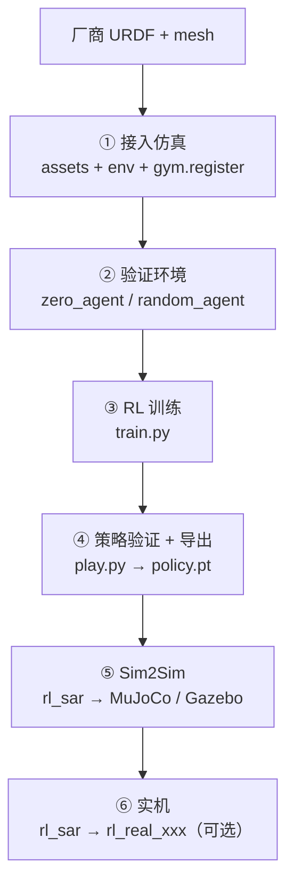

# robot_lab 学习笔记

> 分支：`learn`  
> 仓库：[Elken-lab/robot_lab](https://github.com/Elken-lab/robot_lab)  
> 上游：[fan-ziqi/robot_lab](https://github.com/fan-ziqi/robot_lab)

本文档记录在 `learn` 分支上的学习路线与实践笔记，目标是用 **Unitree H1** 从 URDF 接入到策略训练完整走通一遍。

> **学习过程记录**（按 URDF→实机分章，**实践步骤**写你已做的操作，**知识点**写原理）见 **[KNOWLEDGE.md](./KNOWLEDGE.md)**。  
> 本文档偏 **H1 改 cfg 的逐步教程**；做到哪一步，在 KNOWLEDGE 对应章补实录即可。

---

## 1. 本仓库 Git 说明

| 远程 | 地址 | 用途 |
| --- | --- | --- |
| `origin` | `Elken-lab/robot_lab` | 自己的 fork，**push 到这里** |
| `upstream` | `fan-ziqi/robot_lab` | 原项目，**只 pull 同步** |

| 分支 | 用途 |
| --- | --- |
| `main` | 与上游保持一致，尽量不直接改 |
| `learn` | **所有学习、实验、改配置都在此分支** |
| `devel-*` | fork 时从上游继承的开发分支，**可忽略** |

常用命令：

```bash
git checkout learn
git add .
git commit -m "learn: 描述本次改动"
git push

# 同步上游更新
git fetch upstream
git checkout main && git merge upstream/main
git checkout learn && git merge main
```

---

## 2. 整体流程



若预览不支持 Mermaid，看下面列表即可：

1. 厂商 URDF + mesh
2. **接入仿真** — `assets` + `env` + `gym.register`
3. **验证环境** — `zero_agent` / `random_agent`
4. **RL 训练** — `train.py`
5. **策略验证 + 导出** — `play.py` → `policy.pt`
6. **Sim2Sim** — rl_sar → MuJoCo / Gazebo
7. **实机**（可选）— rl_sar → `rl_real_xxx`

| 阶段 | 在哪做 | 核心产出 |
| --- | --- | --- |
| 接入仿真 | robot_lab | `assets/*.py` + `config/.../` |
| 验证环境 | robot_lab | 确认物理正常、不报错 |
| 训练 | robot_lab + Isaac Sim | `logs/rsl_rl/.../model_*.pt` |
| 导出 | robot_lab `play.py` | `exported/policy.pt` |
| MuJoCo 验证 | [rl_sar](https://github.com/fan-ziqi/rl_sar) | Sim2Sim 通过 |
| 实机 | rl_sar | 真机行走 |

> robot_lab 负责 **Isaac Sim 里训练**；Gazebo / MuJoCo / 实机用 **rl_sar**。

---

## 3. 目录结构速查

```text
robot_lab/
├── source/robot_lab/
│   ├── data/Robots/              # URDF + mesh
│   │   └── unitree/h1_description/ # H1 已下载到此
│   ├── robot_lab/
│   │   ├── assets/               # ArticulationCfg（机器人模型配置）
│   │   └── tasks/manager_based/locomotion/velocity/
│   │       ├── velocity_env_cfg.py   # 基础任务（观测/奖励/地形）
│   │       └── config/humanoid/unitree_h1_learn/
│   │           ├── __init__.py       # gym.register
│   │           ├── flat_env_cfg.py
│   │           ├── rough_env_cfg.py
│   │           └── agents/rsl_rl_ppo_cfg.py
├── scripts/
│   ├── tools/zero_agent.py       # 验证：零动作
│   ├── tools/random_agent.py     # 验证：随机动作
│   └── reinforcement_learning/rsl_rl/
│       ├── train.py
│       └── play.py               # 推理 + 导出 policy.pt
└── docs/LEARNING.md              # 本文档
```

---

## 4. 阶段详解

### 4.1 接入仿真 — 在干什么？

把 URDF 注册成 Isaac Lab 里能 `gym.make()` 的环境。**具体操作见 §5 步骤 1～5。**

**完成标志：** `list_envs.py` 能看到 `...-Unitree-H1-Learn-v0`。

---

### 4.2 验证环境 — 在干什么？

**不训练**，用 dummy 动作检查模型和物理是否正常。

```bash
# 零动作：检查 spawn、穿地、散架
python scripts/tools/zero_agent.py --task=RobotLab-Isaac-Velocity-Flat-Unitree-H1-Learn-v0

# 随机动作：检查物理是否爆炸
python scripts/tools/random_agent.py --task=RobotLab-Isaac-Velocity-Flat-Unitree-H1-Learn-v0
```

| 现象 | 可能原因 |
| --- | --- |
| 穿地 / 一出来就摔 | 初始高度、URDF 碰撞体 |
| 关节乱飞 | URDF 路径、执行器参数 |
| 报错 dimension mismatch | 关节名与 URDF 不一致 |

**通过后再开 `train.py`，否则浪费训练时间。**

---

### 4.3 训练

建议顺序：**Flat 平地 → Rough 崎岖**（可选）。

```bash
python scripts/reinforcement_learning/rsl_rl/train.py \
  --task=RobotLab-Isaac-Velocity-Flat-Unitree-H1-Learn-v0 \
  --headless --num_envs 512 --max_iterations 300

tensorboard --logdir=logs
```

日志：`logs/rsl_rl/unitree_h1_learn_flat/`

---

### 4.4 play + 导出

```bash
python scripts/reinforcement_learning/rsl_rl/play.py \
  --task=RobotLab-Isaac-Velocity-Flat-Unitree-H1-Learn-v0 \
  --load_run <run_folder> --keyboard
```

导出路径：

```text
logs/rsl_rl/<experiment_name>/<run>/exported/
├── policy.pt    # rl_sar 用（LibTorch JIT）
└── policy.onnx
```

---

### 4.5 部署到 MuJoCo（rl_sar）

```bash
# WSL / Linux 中
git clone --recursive https://github.com/fan-ziqi/rl_sar.git
cd rl_sar && ./build.sh -mj

# 复制策略到 rl_sar/policy/h1/robot_lab/
# 对齐 config.yaml 里的 joint_names、action scale

./cmake_build/bin/rl_sim_mujoco h1 scene_29dof
```

> robot_lab 里 `joint_names` 的顺序必须与 rl_sar 的 `config.yaml` 一致。

---

## 5. H1 手把手教程（cfg 用 G1 改）

> **思路：** G1 你已训过 → 它的 cfg 是「本地 URDF 接入」的完整范例。  
> 复制 G1 的配置目录，**逐项改成 H1**；改的过程中对照 `h1.urdf` 和（可选）`unitree_h1/rough_env_cfg.py` 里的 H1 专用参数。

**最终会新增这些文件：**

```text
source/robot_lab/
├── data/Robots/unitree/h1_description/     ← 已有
├── robot_lab/assets/unitree_h1_learn.py  ← 你要新建
└── robot_lab/tasks/.../config/humanoid/unitree_h1_learn/
    ├── __init__.py
    ├── rough_env_cfg.py
    ├── flat_env_cfg.py
    └── agents/
        ├── __init__.py
        ├── rsl_rl_ppo_cfg.py
        └── cusrl_ppo_cfg.py              ← 从 G1 复制后改类名即可
```

**目标环境名：**

- Flat：`RobotLab-Isaac-Velocity-Flat-Unitree-H1-Learn-v0`
- Rough：`RobotLab-Isaac-Velocity-Rough-Unitree-H1-Learn-v0`

---

### 步骤 1：确认 URDF 在位（已完成）

路径：

```text
source/robot_lab/data/Robots/unitree/h1_description/urdf/h1.urdf
source/robot_lab/data/Robots/unitree/h1_description/meshes/
```

用编辑器打开 `h1.urdf`，确认 `<mesh filename="../meshes/...">` 能对应到 `meshes/` 下的文件。

**为什么要做：** URDF 是「图纸」；后面 asset 只是指向这份图纸。

---

### 步骤 2：新建 asset 文件

**新建文件：** `source/robot_lab/robot_lab/assets/unitree_h1_learn.py`

**怎么写：** 打开 `robot_lab/assets/unitree.py`，找到 `UNITREE_G1_29DOF_CFG`，**复制整段结构**，另存为新文件后按下面改。

**必须改的字段：**

| 字段 | G1 里是什么 | H1 改成什么 |
| --- | --- | --- |
| `asset_path` | `.../g1_29dof_rev_1_0.urdf` | `.../h1_description/urdf/h1.urdf` |
| `init_state.pos` | `(0, 0, 0.76)` | `(0, 0, 1.05)` |
| `init_state.joint_pos` | G1 关节名 + 角度 | 见下方 H1 默认姿态 |
| `actuators` | G1 多组电机参数 | 可先 **简化** 为 3 组（见下方示例） |

**H1 默认站立关节角（来自 Isaac Lab `H1_CFG`，单位弧度）：**

```python
joint_pos={
    ".*_hip_yaw": 0.0,
    ".*_hip_roll": 0.0,
    ".*_hip_pitch": -0.28,
    ".*_knee": 0.79,
    ".*_ankle": -0.52,
    "torso": 0.0,
    ".*_shoulder_pitch": 0.28,
    ".*_shoulder_roll": 0.0,
    ".*_shoulder_yaw": 0.0,
    ".*_elbow": 0.52,
},
```

> H1 URDF 里关节名带 `_joint` 后缀（如 `left_hip_yaw_joint`），上面用正则 `.*_hip_yaw` 一般能匹配；若 spawn 后姿态不对，改成完整名字。

**执行器可先简化（够用来学习验证）：** 不必一开始就算 G1 那套 STIFFNESS 公式，参考官方 H1 分三组即可：

```python
actuators={
    "legs": ImplicitActuatorCfg(
        joint_names_expr=[".*_hip_yaw", ".*_hip_roll", ".*_hip_pitch", ".*_knee", "torso"],
        stiffness={".*_hip_yaw": 150.0, ".*_hip_roll": 150.0, ".*_hip_pitch": 200.0, ".*_knee": 200.0, "torso": 200.0},
        damping={".*_hip_yaw": 5.0, ".*_hip_roll": 5.0, ".*_hip_pitch": 5.0, ".*_knee": 5.0, "torso": 5.0},
    ),
    "feet": ImplicitActuatorCfg(
        joint_names_expr=[".*_ankle"],
        stiffness={".*_ankle": 20.0},
        damping={".*_ankle": 4.0},
    ),
    "arms": ImplicitActuatorCfg(
        joint_names_expr=[".*_shoulder_pitch", ".*_shoulder_roll", ".*_shoulder_yaw", ".*_elbow"],
        stiffness=40.0,
        damping=10.0,
    ),
},
```

文件末尾导出：

```python
UNITREE_H1_LEARN_CFG = ArticulationCfg(...)  # 你的变量名
```

**为什么要做：** env 配置里的 `self.scene.robot = XXX_CFG` 必须指向 **你的** H1 asset，不能再用 G1 或云端 USD。

**自检：** 在项目根目录执行：

```bash
python -c "from robot_lab.assets.unitree_h1_learn import UNITREE_H1_LEARN_CFG; print(UNITREE_H1_LEARN_CFG)"
```

不报错即可进入下一步。

---

### 步骤 3：复制 G1 配置目录

在资源管理器或终端里：

```text
复制：
  source/robot_lab/robot_lab/tasks/manager_based/locomotion/velocity/config/humanoid/unitree_g1/

到：
  source/robot_lab/robot_lab/tasks/manager_based/locomotion/velocity/config/humanoid/unitree_h1_learn/
```

PowerShell 示例（在仓库根目录 `robot_lab/` 下）：

```powershell
Copy-Item -Recurse `
  source\robot_lab\robot_lab\tasks\manager_based\locomotion\velocity\config\humanoid\unitree_g1 `
  source\robot_lab\robot_lab\tasks\manager_based\locomotion\velocity\config\humanoid\unitree_h1_learn
```

**为什么要复制 G1 而不是 H1 官方：** G1 整条链路是本地 URDF；H1 官方 env 用云端 USD，结构和你要练的不一致。

---

### 步骤 4：逐个文件修改（核心）

下面用 **「查找 → 替换」** 的方式写。每个文件改完保存。

---

#### 4.1 `rough_env_cfg.py`

**① 改 import（文件顶部）**

```python
# 删除
from robot_lab.assets.unitree import UNITREE_G1_29DOF_ACTION_SCALE, UNITREE_G1_29DOF_CFG

# 改成
from robot_lab.assets.unitree_h1_learn import UNITREE_H1_LEARN_CFG
```

**② 改类名**

```python
# UnitreeG1RoughEnvCfg  →  UnitreeH1LearnRoughEnvCfg
class UnitreeH1LearnRoughEnvCfg(LocomotionVelocityRoughEnvCfg):
```

**③ 改 link 名（类属性，约第 17–18 行）**

```python
base_link_name = "torso_link"      # 和 G1 相同，可不动
foot_link_name = ".*ankle_link"    # G1 是 ".*_ankle_roll_link"，H1 必须改
```

**④ 改 `__post_init__` 里的机器人引用**

```python
# self.scene.robot = UNITREE_G1_29DOF_CFG.replace(...)
self.scene.robot = UNITREE_H1_LEARN_CFG.replace(prim_path="{ENV_REGEX_NS}/Robot")
```

**⑤ 改动作 scale（Actions 段）**

```python
# G1：
# self.actions.joint_pos.scale = UNITREE_G1_29DOF_ACTION_SCALE

# H1 先改成统一 scale（和官方 H1 env 一致）：
self.actions.joint_pos.scale = 0.25
```

**⑥ 改 Rewards 里和 G1 结构不同的几处**

| 位置（搜关键字） | G1 写法 | 改成 H1 |
| --- | --- | --- |
| `joint_deviation_torso` | `["waist_yaw_joint"]` | `["torso"]` |
| `joint_deviation_hip` | `".*hip_yaw.*", ".*hip_roll.*"` | `[".*_hip_yaw", ".*_hip_roll"]` |
| `joint_deviation_arms` | `".*shoulder.*", ".*elbow.*"` | `[".*_shoulder_.*", ".*_elbow"]` |
| `joint_torques_l2` 的 joint_names | `".*_hip_.*", ".*_knee_joint", ".*_ankle_.*"` | `".*_hip_.*", ".*_knee", ".*_ankle"` |
| `joint_mirror` / `action_mirror` | 有左右镜像 regex | **先关掉**（和官方 H1 一致）： |

关掉镜像示例：

```python
self.rewards.joint_mirror.weight = 0
self.rewards.joint_mirror.params["mirror_joints"] = [["", ""]]
self.rewards.action_mirror.weight = 0
self.rewards.action_mirror.params["mirror_joints"] = [["", ""]]
```

**⑦ 改 `disable_zero_weight_rewards` 的类名判断（文件末尾附近）**

```python
# if self.__class__.__name__ == "UnitreeG1RoughEnvCfg":
if self.__class__.__name__ == "UnitreeH1LearnRoughEnvCfg":
    self.disable_zero_weight_rewards()
```

**可选：** 奖励权重拿不准时，打开 `unitree_h1/rough_env_cfg.py` **只抄 Rewards 段的数字**（不要抄它的 `H1_MINIMAL_CFG` import）。

---

#### 4.2 `flat_env_cfg.py`

**① 改 import 的父类**

```python
from .rough_env_cfg import UnitreeH1LearnRoughEnvCfg

@configclass
class UnitreeH1LearnFlatEnvCfg(UnitreeH1LearnRoughEnvCfg):
```

**② 改类名判断**

```python
if self.__class__.__name__ == "UnitreeH1LearnFlatEnvCfg":
    self.disable_zero_weight_rewards()
```

其余（改 `terrain_type = "plane"` 等）**和 G1 flat 一样，可不动**。

---

#### 4.3 `__init__.py`

整文件替换为类似下面（注意类名、路径）：

```python
import gymnasium as gym
from . import agents

gym.register(
    id="RobotLab-Isaac-Velocity-Rough-Unitree-H1-Learn-v0",
    entry_point="isaaclab.envs:ManagerBasedRLEnv",
    disable_env_checker=True,
    kwargs={
        "env_cfg_entry_point": f"{__name__}.rough_env_cfg:UnitreeH1LearnRoughEnvCfg",
        "rsl_rl_cfg_entry_point": f"{agents.__name__}.rsl_rl_ppo_cfg:UnitreeH1LearnRoughPPORunnerCfg",
        "cusrl_cfg_entry_point": f"{agents.__name__}.cusrl_ppo_cfg:UnitreeH1LearnRoughTrainerCfg",
    },
)

gym.register(
    id="RobotLab-Isaac-Velocity-Flat-Unitree-H1-Learn-v0",
    entry_point="isaaclab.envs:ManagerBasedRLEnv",
    disable_env_checker=True,
    kwargs={
        "env_cfg_entry_point": f"{__name__}.flat_env_cfg:UnitreeH1LearnFlatEnvCfg",
        "rsl_rl_cfg_entry_point": f"{agents.__name__}.rsl_rl_ppo_cfg:UnitreeH1LearnFlatPPORunnerCfg",
        "cusrl_cfg_entry_point": f"{agents.__name__}.cusrl_ppo_cfg:UnitreeH1LearnFlatTrainerCfg",
    },
)
```

**为什么要改：** Python 靠这里的字符串找到你的配置类；id 里带 `H1-Learn` 才和 G1 / 官方 H1 区分开。

---

#### 4.4 `agents/rsl_rl_ppo_cfg.py`

全局替换类名 + 改实验名：

| 原 G1 | 改成 |
| --- | --- |
| `UnitreeG1RoughPPORunnerCfg` | `UnitreeH1LearnRoughPPORunnerCfg` |
| `UnitreeG1FlatPPORunnerCfg` | `UnitreeH1LearnFlatPPORunnerCfg` |
| `experiment_name = "unitree_g1_rough"` | `"unitree_h1_learn_rough"` |
| `experiment_name = "unitree_g1_flat"` | `"unitree_h1_learn_flat"` |

PPO 超参（hidden_dims、learning_rate 等）**先别动**。

---

#### 4.5 `agents/cusrl_ppo_cfg.py`（可选）

同样把 `UnitreeG1*` → `UnitreeH1Learn*`，`unitree_g1_*` → `unitree_h1_learn_*`。不用 CusRL 可暂时不改。

---

### 步骤 5：安装并确认注册成功

在仓库根目录、Isaac Lab 的 Python 环境下：

```bash
python -m pip install -e source/robot_lab
python scripts/tools/list_envs.py | findstr H1-Learn
```

应看到两行类似：

```text
RobotLab-Isaac-Velocity-Flat-Unitree-H1-Learn-v0
RobotLab-Isaac-Velocity-Rough-Unitree-H1-Learn-v0
```

**看不到：** 检查 `unitree_h1_learn/__init__.py` 有没有语法错误；是否忘了 `pip install -e`。

---

### 步骤 6：验证环境（必做）

```bash
python scripts/tools/zero_agent.py --task=RobotLab-Isaac-Velocity-Flat-Unitree-H1-Learn-v0
```

**正常：** H1 出现在平地，脚触地，不会立刻穿透或散架。

```bash
python scripts/tools/random_agent.py --task=RobotLab-Isaac-Velocity-Flat-Unitree-H1-Learn-v0
```

**正常：** 关节乱动但仿真不「爆炸」（不飞天、不 NaN）。

| 现象 | 查什么 |
| --- | --- |
| 报错找不到 mesh | `h1.urdf` 里 mesh 路径 vs `meshes/` 目录 |
| 一出来就穿地 | `init_state.pos` 的 z 调大，如 `1.05 → 1.10` |
| 姿态扭曲 | `joint_pos` 正则是否匹配 URDF 关节名 |
| 立刻物理爆炸 | 执行器 stiffness 太大 → 先减半试试 |
| ModuleNotFoundError | asset 文件名 / 类名 / `pip install -e` |

**为什么要做：** 训练一次很贵；这里 1 分钟能排除 80% 配置错误。

---

### 步骤 7：短训 + play

```bash
python scripts/reinforcement_learning/rsl_rl/train.py \
  --task=RobotLab-Isaac-Velocity-Flat-Unitree-H1-Learn-v0 \
  --headless --num_envs 512 --max_iterations 300

python scripts/reinforcement_learning/rsl_rl/play.py \
  --task=RobotLab-Isaac-Velocity-Flat-Unitree-H1-Learn-v0 \
  --load_run <你的run目录> --keyboard
```

日志目录：`logs/rsl_rl/unitree_h1_learn_flat/`

300 iter 只验证「能训、loss 在动」；要走得像样需几千 iter。

---

### 步骤 8：和 G1 / 官方 H1 对照理解

| 对比 | 你练的 `unitree_h1_learn` | 你已训的 G1 | 官方 `unitree_h1` |
| --- | --- | --- | --- |
| 模型 | 本地 `h1.urdf` | 本地 `g1_29dof.urdf` | 云端 `h1_minimal.usd` |
| cfg 模板来源 | 从 G1 改来 | 原版 G1 | 独立编写 |
| 学习点 | G1→H1 差异（脚、腰、DOF） | 已跑通 | 可抄 reward 数字 |

---

### G1 → H1 差异速查表

| 项目 | G1 | H1 |
| --- | --- | --- |
| 自由度 | 29 | 19（无 waist 三连，踝单关节） |
| 脚 link | `left_ankle_roll_link` | `left_ankle_link` |
| 腰 | `waist_yaw_joint` | `torso_joint` |
| 踝 | pitch + roll 两个关节 | 一个 `ankle_joint` |
| 典型站立高度 | z ≈ 0.76 | z ≈ 1.05 |
| action scale | 按关节分别算 | 可先统一 `0.25` |

---

### 建议分三次提交（方便回溯）

1. `learn: add unitree_h1_learn asset` — 只有 asset，能 import  
2. `learn: add unitree_h1_learn env config` — cfg 全套，`zero_agent` 通过  
3. `learn: h1 learn flat smoke train` — 短训日志（可选）

---

**不要抄整份 `unitree_h1` 当模板**：它用 USD，改完和官方几乎一样，学不到「从 G1 模板迁到 H1」的过程。

---

## 6. 关键概念笔记

### height scan（高度扫描）

- 仿真里用射线网格扫描脚下地形高度
- **Rough 训练可用，实机通常没有**
- H1 配置会关掉：`self.observations.policy.height_scan = None`
- 关掉 = **盲走**：靠 IMU + 关节反馈应对地形，不是提前「看见」台阶

### H1 两种模型来源

| 来源 | 路径 | 说明 |
| --- | --- | --- |
| 本地 URDF（学习用） | `data/Robots/unitree/h1_description/` | 从 unitree_ros 下载，自己写 asset |
| 官方 USD（现成 env） | `isaaclab_assets` → `h1_minimal.usd` | `unitree_h1` 环境直接用 |

### H1_CFG vs H1_MINIMAL_CFG

| 对比项 | H1_CFG | H1_MINIMAL_CFG |
| --- | --- | --- |
| 文件 | `h1.usd` | `h1_minimal.usd` |
| 碰撞体 | 完整 | 精简 |
| 训练速度 | 较慢 | 更快（官方 env 默认） |

---

## 7. 已跑通的 G1 流水线（个人记录）

```bash
# 1. 训练（Isaac Sim / robot_lab）
python scripts/reinforcement_learning/rsl_rl/train.py \
  --task=RobotLab-Isaac-Velocity-Flat-Unitree-G1-v0 --headless

# 2. play 验证 + 导出
python scripts/reinforcement_learning/rsl_rl/play.py \
  --task=RobotLab-Isaac-Velocity-Flat-Unitree-G1-v0 --keyboard

# 3. MuJoCo Sim2Sim（WSL + rl_sar）
./cmake_build/bin/rl_sim_mujoco g1 scene_29dof
```

---

## 8. 命令速查

```bash
# 安装
python -m pip install -e source/robot_lab

# 列出环境
python scripts/tools/list_envs.py

# 验证
python scripts/tools/zero_agent.py --task=<ENV_NAME>
python scripts/tools/random_agent.py --task=<ENV_NAME>

# 训练 / 推理
python scripts/reinforcement_learning/rsl_rl/train.py --task=<ENV_NAME> --headless
python scripts/reinforcement_learning/rsl_rl/play.py --task=<ENV_NAME> --keyboard

# TensorBoard
tensorboard --logdir=logs
```

---

## 9. 学习进度 Checklist

- [ ] §5 步骤 2：写完 `assets/unitree_h1_learn.py`，import 不报错
- [ ] §5 步骤 3～4：复制 G1 → `unitree_h1_learn/`，改完 5 个文件
- [ ] §5 步骤 5：`list_envs.py` 能看到 `H1-Learn`
- [ ] §5 步骤 6：`zero_agent` + `random_agent` 通过
- [ ] §5 步骤 7：Flat 短训 300 iter + `play --keyboard`
- [ ] （可选）导出 `policy.pt`，rl_sar MuJoCo 验证

---

## 10. 参考链接

- [robot_lab 原仓库](https://github.com/fan-ziqi/robot_lab)
- [Isaac Lab 文档](https://isaac-sim.github.io/IsaacLab)
- [rl_sar（Sim2Sim + 实机）](https://github.com/fan-ziqi/rl_sar)
- [Unitree ROS（URDF 源）](https://github.com/unitreerobotics/unitree_ros)

---

*最后更新：2026-06-01 · 分支 `learn` · 练习机器人：Unitree H1*
